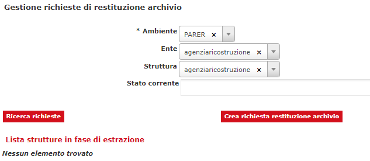

# SACER TEST

Fonte template redazione documento:  https://www.makeareadme.com/.


# Descrizione

SACER è il modulo centrale del Sistema di Conservazione e gestisce l'intero processo di conservazione di Unità documentarie e Fascicoli, a partire dall'acquisizione dei Pacchetti di versamento (SIP) via web-service fino alla generazione dei Pacchetti di Archiviazione (AIP) e la messa a disposizione dei Pacchetti di distribuzione (DIP). SACER mette a disposizione, sia tramite web service, sia  tramite interfaccia utente, funzionalità di annullamento degli oggetti versati. Inoltre, il sistema consente di organizzare Unità documentarie e Fascicoli in Serie, le quali sono a loro volta sottoposte. 


# Installazione

Requisiti minimi per installazione: 

- Sistema operativo : consigliato Linux server (in alternativa compatibilità con Windows server);
- Java versione 11 (OpenJDK / Oracle);
- JBoss 7 EAP;
- Oracle DB (versione consigliata 19c).

## Installazione JDK 

Consigliata adozione della OpenJDK alla versione 8, guida all'installazione https://openjdk.org/install/.

## Setup application server (JBoss 7)

Richiesta l'esecuzione delle seguenti guide secondo l'ordine riportato di seguito: 

1. guida per la configurazione **base** di [guida 1](src/docs/JBoss7_configurazione_generale.md);
2. guida con le configurazioni **specifiche** per il contesto applicativo **SIAM**  di [guida 2](src/docs/JBoss7_configurazione_siam.md).

### Deploy su JBoss 7

Di seguito le indicazioni per il rilascio su application server JBoss7: 

1. generazione dell'artifact attraverso tool maven, eseguire il seguente comando: 

   ```bash
   mvn package
   ```
   
2. viene generato l'artifact .ear all'interno del modulo sacer-ear/target (e.g. sacer-9.3.1.ear)
3. deploy dell'ear generato allo step 1 su JBoss 7 (vedi configurazione [setup JBoss7](#setup-application-server-jboss-7))

## Predisposizione database

L'applicazione utilizza come DBMS di riferimento Oracle DB (https://www.oracle.com/it/database/) alla versione, consigliata, **19c**. Per l'installazione e la configurazione fare riferimento alle guide ufficiali.

Per la creazione del modello E-R consultare il seguente [README.md](https://github.com/RegioneER/parer-db-init/blob/master/README.md) (progetto di riferimento https://github.com/RegioneER/parer-db-init).

## Configurazione bucket S3 Object Storage

L'applicazione può essere integrata sulla base delle configurazioni impostate, vedi paragrafo [Setup application server (Jboss 7)](#setup-application-server-jboss-7), ad uno storage grid o object storage attraverso lo standard [AWS S3](https://aws.amazon.com/it/s3/).

In questa sezione si vuole proporre un possibile scenario di configurazione dei bucket e, in particolar modo, di eventuali [lifecycle](https://docs.aws.amazon.com/AmazonS3/latest/userguide/object-lifecycle-mgmt.html) legati ad alcuni bucket, essenziali per gestire in modo corretto ed opportuno il ciclo di vita degli oggetti all'interno di determinati bucket; su quest'ultimo aspetto, si sottolinea, che alcuni flussi applicativi/servizi prevedono la creazione di oggetto "temporanei" ossia la cui esistenza è prevista per un determinato periodo temporale dopo il quale possono essere eliminati dal bucket stesso.

### Configurazione dei bucket

Una possibile configurazione dei bucket, proposta, è la seguente: 

- aggiornamenti-metadati : oggetti prodotti dal servizio di Aggiornamento Metadati (vedi README.md progetto "sacerws");
- aip : oggetti prodotti dai processi di creazione dell'AIP;
- componenti : oggetti prodotti dai servizi di Versamento Unità Documentarie/Aggiunta documenti (vedi README.md progetto "sacerws");
- indici-aip : oggetti prodotti dai processi di creazione degli indici AIP;
- reportvf : oggetti prodotti dalla creazione di report verifica firma su documenti processati dai servizi di Versamento Unità Documentarie/Aggiunta documenti (vedi README.md progetto "sacerws");
- sessioni-agg-md-err-ko  : oggetti prodotti dal servizio di Aggiornamento Metadati (vedi README.md progetto "sacerws");
- vrs-staging : oggetti prodotti dai servizi di Versamento Unità Documentarie/Aggiunta documenti (vedi README.md progetto "sacerws").

I bucket possono essere creati con / senza versioning, alcuni dei bucket prevedono l'applicazione di lifecycle policy (consigliato), nello specifico: 
- vrs-staging;
- sessioni-agg-md-err-ko.

#### Lifecyle policy : casi d'uso

Bucket : vrs-staging

Esempio di lifecycle applicata (con filtri per tag)

```json
{
    "Rules": [
        {
            "Expiration": {
                "Days": 183
            },
            "ID": "default_no_tag",
            "Filter": {
                "Prefix": ""
            },
            "Status": "Enabled"
        },
        {
            "Expiration": {
                "Days": 92
            },
            "ID": "file_componente_uddoc",
            "Filter": {
                "And": {
                    "Prefix": "",
                    "Tags": [
                        {
                            "Key": "vrs-object-type",
                            "Value": "file_componente_uddoc"
                        }
                    ]
                }
            },
            "Status": "Enabled"
        },
        {
            "Expiration": {
                "Days": 183
            },
            "ID": "xml_metadati_uddoc",
            "Filter": {
                "And": {
                    "Prefix": "",
                    "Tags": [
                        {
                            "Key": "vrs-object-type",
                            "Value": "xml_metadati_uddoc"
                        }
                    ]
                }
            },
            "Status": "Enabled"
        },
        {
            "Expiration": {
                "Days": 30
            },
            "ID": "orphan_objects",
            "Filter": {
                "And": {
                    "Prefix": "",
                    "Tags": [
                        {
                            "Key": "orphan",
                            "Value": "true"
                        }
                    ]
                }
            },
            "Status": "Enabled"
        },
        {
            "Expiration": {
                "Days": 2
            },
            "ID": "temporany_object",
            "Filter": {
                "And": {
                    "Prefix": "",
                    "Tags": [
                        {
                            "Key": "vrs-object-type",
                            "Value": "temporany"
                        }
                    ]
                }
            },
            "Status": "Enabled"
        }
    ]
}
```


# Utilizzo

SACER è il modulo centrale del Sistema di Conservazione e gestisce l'intero processo di conservazione di Unità documentarie e Fascicoli, a partire dall'acquisizione dei Pacchetti di versamento (SIP) via web-service fino alla generazione dei Pacchetti di Archiviazione (AIP) e la messa a disposizione dei Pacchetti di distribuzione (DIP). SACER mette a disposizione, sia tramite web service, sia  tramite interfaccia utente, funzionalità di annullamento degli oggetti versati. Inoltre, il sistema consente di organizzare Unità documentarie e Fascicoli in Serie, le quali sono a loro volta sottoposte. 

Le funzionalità implementate da Sacer coprono le varie fasi del processo di conservazione previste dallo standard OAIS, ovvero:  

* Acquisizione;
* Gestione dati;
* Archiviazione;
* Amministrazione;
* Accesso.   

**Le funzionalità di Acquisizione di SacER** consentono la gestione delle varie fasi del processo di Acquisizione e presa in carico. Operativamente si compongono delle seguenti attività:  

* acquisizione del SIP trasmesso attraverso i Servizi di versamento;  

* **memorizzazione** del SIP in un’area temporanea logicamente distinta dall’archivio vero e proprio per effettuare le verifiche previste;  

* verifica del SIP in relazione alla struttura dati, ai metadati degli oggetti sottoposti a conservazione, alle eventuali firme apposte sui file (**Oggetti-dati**) associati ai **Componenti**, ai formati dei file stessi e generazione del Rapporto di versamento in caso di verifica positiva;  

* restituzione dell’**Esito versamento**, comprensivo, in caso di esito positivo, del Rapporto di versamento;  

* creazione degli **Elenchi di versamento**: attraverso vari job eseguiti sugli Application server automaticamente e in modo ricorrente secondo intervalli di tempo stabiliti nel modulo Amministrazione i SIP sono raggruppati in Elenchi di versamento, validati dal Responsabile della funzione ed elaborati per produrre i relativi AIP; 

* eventuale migrazione di **formato** degli **Oggetti-dati** contenuti nei SIP sia per contrastarne l’obsolescenza tecnologica, sia per esigenze di miglioramento della fruibilità degli oggetti conservati;  

* estrazione dei metadati dal SIP (ed eventuale loro normalizzazione) e dal Sistema da utilizzare per completare le informazioni necessarie a generare l’AIP (**Informazioni sulla rappresentazione, Informazioni sulla conservazione, Informazioni sull’impacchettamento, Informazioni descrittive**);  

* generazione dell’**Indice dell’AIP**, utilizzando i metadati estratti dal SIP e quelli generati dal Sistema nel corso del processo di conservazione. SacER produce report di eccezioni a fronte di situazioni anomale nella creazione dell’**Indice dell’AIP**. Tutte le azioni vengono registrate sul sistema in apposite tabelle di log;  

* generazione dell’AIP, che avviene impacchettando in un oggetto auto-consistente l’**Indice dell’AIP**, le evidenze informatiche prodotte nel corso del processo di conservazione e gli **Oggetti-dati**.  


Le funzionalità di **Gestione Dati di SacER** sono finalizzate principalmente a gestire le Informazioni descrittive degli AIP generate durante il processo di acquisizione e includono:  

* la memorizzazione dei metadati estratti dal SIP o generati dal Sistema nel corso del processo di Acquisizione dei SIP;  

* la gestione degli aggiornamenti dei dati generati dalle funzionalità di Amministrazione e nel corso del processo di conservazione;  

* l’esecuzione delle ricerche e la sua restituzione alle funzionalità di Accesso, che avvengono mediante l’utilizzo di funzionalità da interfaccia web del Sistema o mediante chiamata a Servizi specifici.  


Le funzionalità di **Archiviazione di SacER** gestiscono la parte del processo di Gestione dell’AIP relativa alla memorizzazione e verifica degli Oggetti-dati su Data Base Oracle e file system (vedi paragrafo 7.5) e comprendono:  

* la **memorizzazione** degli AIP e l’organizzazione gerarchica dei supporti di memorizzazione. In particolare, gli Oggetti-dati degli AIP, costituiti dagli Indici degli AIP e dei SIP, dagli Esiti versamento, dai Rapporti di versamento e dai file associati ai Componenti, sono memorizzati su supporti di diverso tipo in ragione della loro dimensione e della frequenza con cui vengono ricercati:  

* gli **Oggetti-dati** vengono memorizzati in modo permanente nell’object storage; 

* gli **Oggetti-dati** di grande dimensione e di accesso meno frequente vengono salvati temporaneamente su file system in cartelle opportunamente strutturate, per poi essere memorizzati in modo permanente su supporti a cassette, utilizzando a questo scopo un apposito componente software chiamato TPI, descritto più avanti;  

* il controllo dell’integrità degli oggetti conservati, comprensivo della copia degli archivi, del controllo degli errori e delle procedure di refreshing dei supporti, in conformità con il Piano della Sicurezza del servizio di conservazione;  

* la restituzione dei pacchetti alle funzioni di Accesso, mediante opportune funzionalità dell’interfaccia web del Sistema o mediante l’utilizzo di Servizi di recupero esposti da Sacer e descritti nel documento Specifiche tecniche dei servizi di recupero;  

* l’annullamento dei versamenti effettuati, mediante opportune funzionalità dell’interfaccia web del Sistema o mediante l’utilizzo di Servizi di annullamento esposti da Sacer e descritti nel documento Specifiche tecniche dei servizi di annullamento; 

* la cancellazione degli AIP sottoposti a scarto o a seguito di restituzione dei documenti conservati ai Produttore alla cessazione del servizio. 


Le **funzionalità di Amministrazione di SacER** consentono di gestire configurazioni e parametrazioni in grado di determinare il funzionamento del Sistema in funzione degli specifici accordi intercorsi con i Produttori. Inoltre, consentono di monitorare tutta l’attività svolta da SacER. In particolare, in SacER è possibile configurare tutte le entità significative: Enti, Strutture, operatori e relativi profili, tipologie documentarie, formati accettati, logiche di controllo dei versamenti, logiche di creazione delle Serie, regole di accesso e di esibizione, politiche di monitoraggio del sistema. Anche l’interfaccia web di SacER è configurata automaticamente in ragione del profilo dei singoli operatori che vi accedono.  

Le funzionalità di Amministrazione sono costituite da transazioni eseguibili tramite l’interfaccia web del sistema e riservate agli operatori di ParER, ma visibili negli esiti anche agli operatori dei Produttori.

Le **funzionalità di Accesso di SacER** consentono di restituire in forma di DIP gli oggetti conservati. A tal fine SacER mette a disposizione un’interfaccia web per le ricerche e per l’estrazione manuale dei documenti e dei Servizi di recupero per l’estrazione automatica.  

Gli AIP forniti sono trasformati in DIP sulla base delle caratteristiche dell’oggetto e degli utilizzi cui è destinato. In molti casi la trasformazione dell’AIP in DIP può richiedere specifici passi elaborativi e trasformazioni complesse, che, necessitando di elaborazioni onerose, vengono normalmente eseguite da opportuni job batch e mantenute in modo permanente sul Data Base. Secondo la natura dei DIP, l’esibizione può avvenire on-line con un download, oppure tramite il trasferimento in un’area di transito, da cui il successivo recupero viene effettuato dal sistema richiedente con chiamata FTP. In molti casi, per comodità di trasferimento e recupero, i vari elementi che costituiscono il DIP vengono compressi in un archivio di tipo ZIP.   

Il **modulo di Accesso**, oltre a verificare tramite i servizi di Autenticazione l’abilitazione dell’Utente al recupero del documento, traccia in apposite tabelle di log tutte le richieste prevenute, qualunque ne sia stato l’esito.     

### Ricerche nell'archivio

Il sistema consente di effettuare ricerche su Unità documentarie, fascicoli e serie. 

 


È possibile effettuare ricerche usando come filtri i metadati dell'oggetto versato, secondo i parametri di versamento (ad esempio secondo la versione del servizio di versamento utilizzato) o secondo i controlli eseguiti al momento del versamento. 

 

### Elenchi di versamento

 

Questa sezione consente di gestire il processo di conservazione fino alla produzione dell'indice del pacchetto di archiviazione AIP. 

 

### Monitoraggio

 

La sezione di monitoraggio consente la verifica delle funzioni vitali del sistema  e del contenuto dell'archivio, consentendo ad esempio di monitorare i flussi di versamento e lo stato del processo di conservazione. 

 


### Strutture versanti

 

Questa sezione consente la creazione di nuove strutture di archivio offrendo funzioni di replica, importazione. 

 

### Registro formati

Anagrafica del sistema nel quale i formati, accettati a seguito di una procedura di valutazione, vengono censiti. Ogni formato viene descritto e accompagnati da attributi di qualità. 

Sulle strutture versanti sono poi configurati in modo specifico i formati che il produttore vuole ammette sulla struttura. 

 


### Annullamento versamenti

 

Sezione che consente la gestione dell'annullamento di unità documentarie e fascicoli. 


 

### Restituzione archivio

 

Sezione che consente la gestione del processo di restituzione archvio di una struttura cessata, dalla richiesta all'estrazione del contenuto.  

 

# Librerie utilizzate


|  GroupId | ArtifactId  | Version |
|:---:|:---:|:---:|
|none|||
|com.fasterxml.jackson.core|jackson-annotations|2.12.7.redhat-00003|
|com.fasterxml.jackson.core|jackson-core|2.12.7.redhat-00003|
|com.fasterxml.jackson.core|jackson-databind|2.12.7.redhat-00003|
|com.fasterxml.woodstox|woodstox-core|6.4.0.redhat-00001|
|com.fasterxml|classmate|1.5.1.redhat-00001|
|com.io7m.xom|xom|1.2.10|
|com.narupley|not-going-to-be-commons-ssl|0.3.20|
|com.sun.activation|jakarta.activation|1.2.2.redhat-00002|
|com.sun.istack|istack-commons-runtime|3.0.10.redhat-00001|
|com.sun.mail|jakarta.mail|1.6.7.redhat-00003|
|com.zaxxer|SparseBitSet|1.3|
|commons-beanutils|commons-beanutils|1.9.4|
|commons-codec|commons-codec|1.17.1|
|commons-fileupload|commons-fileupload|1.5|
|commons-io|commons-io|2.16.1|
|commons-logging|commons-logging|1.3.3|
|commons-net|commons-net|3.9.0|
|it.eng.parer|spagofat-core|6.15.0|
|it.eng.parer|spagofat-middle|6.15.0|
|it.eng.parer|spagofat-paginator-ejb|6.15.0|
|it.eng.parer|spagofat-paginator-gf|6.15.0|
|it.eng.parer|spagofat-sl-jpa|6.15.0|
|it.eng.parer|spagofat-timer-wrapper-common|6.15.0|
|jakarta.activation|jakarta.activation-api|2.1.2|
|jakarta.enterprise|jakarta.enterprise.cdi-api|2.0.2.redhat-00002|
|jakarta.inject|jakarta.inject-api|1.0.3.redhat-00001|
|jakarta.json.bind|jakarta.json.bind-api|1.0.2.redhat-00001|
|jakarta.json|jakarta.json-api|1.1.6.redhat-00001|
|jakarta.persistence|jakarta.persistence-api|2.2.3.redhat-00001|
|jakarta.security.enterprise|jakarta.security.enterprise-api|1.0.2.redhat-00001|
|jakarta.validation|jakarta.validation-api|2.0.2.redhat-00001|
|jakarta.xml.bind|jakarta.xml.bind-api|2.3.2|
|javax.activation|javax.activation-api|1.2.0|
|javax.annotation|javax.annotation-api|1.3.2|
|javax.jws|jsr181-api|1.0.0.MR1-redhat-8|
|javax.persistence|javax.persistence-api|2.2|
|javax.validation|validation-api|2.0.1.Final|
|javax.xml.bind|jaxb-api|2.3.0|
|javax.xml.soap|javax.xml.soap-api|1.4.0|
|javax.xml.ws|jaxws-api|2.3.1|
|joda-time|joda-time|2.12.5|
|net.bytebuddy|byte-buddy|1.11.12.redhat-00002|
|org.apache-extras.beanshell|bsh|2.0b6|
|org.apache.commons|commons-collections4|4.5.0-M2|
|org.apache.commons|commons-lang3|3.15.0|
|org.apache.commons|commons-math3|3.6.1|
|org.apache.commons|commons-text|1.12.0|
|org.apache.httpcomponents|httpclient|4.5.14|
|org.apache.httpcomponents|httpcore|4.4.16|
|org.apache.logging.log4j|log4j-api|2.23.1|
|org.apache.poi|poi|5.3.0|
|org.apache.santuario|xmlsec|4.0.2|
|org.apache.taglibs|taglibs-standard-impl|1.2.6.RC1-redhat-1|
|org.apache.taglibs|taglibs-standard-spec|1.2.6.RC1-redhat-1|
|org.apache.velocity|velocity-engine-core|2.3|
|org.apache.xmlbeans|xmlbeans|5.1.1|
|org.bouncycastle|bcpkix-jdk18on|1.77|
|org.bouncycastle|bcprov-jdk18on|1.77|
|org.bouncycastle|bcutil-jdk18on|1.77|
|org.codehaus.jettison|jettison|1.5.4|
|org.codehaus.woodstox|stax2-api|4.2.1.redhat-00001|
|org.dom4j|dom4j|2.1.4|
|org.eclipse.microprofile.openapi|microprofile-openapi-api|3.1.1|
|org.eclipse.persistence|org.eclipse.persistence.antlr|2.3.2|
|org.eclipse.persistence|org.eclipse.persistence.asm|2.3.2|
|org.eclipse.persistence|org.eclipse.persistence.core|2.3.2|
|org.eclipse.persistence|org.eclipse.persistence.moxy|2.3.2|
|org.glassfish.jaxb|jaxb-runtime|2.3.3.b02-redhat-00002|
|org.glassfish.jaxb|txw2|2.3.3.b02-redhat-00002|
|org.hibernate.common|hibernate-commons-annotations|5.0.5.Final-redhat-00002|
|org.hibernate.validator|hibernate-validator|6.0.22.Final-redhat-00002|
|org.hibernate|hibernate-core|5.3.20.Final-redhat-00001|
|org.hibernate|hibernate-jpamodelgen|5.6.14.Final-redhat-00001|
|org.javassist|javassist|3.27.0.GA-redhat-00001|
|org.jboss.logging|jboss-logging|3.4.1.Final-redhat-00001|
|org.jboss.spec.javax.annotation|jboss-annotations-api_1.3_spec|2.0.1.Final-redhat-00001|
|org.jboss.spec.javax.batch|jboss-batch-api_1.0_spec|2.0.0.Final-redhat-00001|
|org.jboss.spec.javax.ejb|jboss-ejb-api_3.2_spec|2.0.0.Final-redhat-00001|
|org.jboss.spec.javax.el|jboss-el-api_3.0_spec|2.0.1.Final-redhat-00001|
|org.jboss.spec.javax.enterprise.concurrent|jboss-concurrency-api_1.0_spec|2.0.0.Final-redhat-00001|
|org.jboss.spec.javax.faces|jboss-jsf-api_2.3_spec|3.0.0.SP08-redhat-00001|
|org.jboss.spec.javax.interceptor|jboss-interceptors-api_1.2_spec|2.0.0.Final-redhat-00002|
|org.jboss.spec.javax.jms|jboss-jms-api_2.0_spec|2.0.0.Final-redhat-00001|
|org.jboss.spec.javax.management.j2ee|jboss-j2eemgmt-api_1.1_spec|2.0.0.Final-redhat-00001|
|org.jboss.spec.javax.resource|jboss-connector-api_1.7_spec|2.0.0.Final-redhat-00001|
|org.jboss.spec.javax.security.auth.message|jboss-jaspi-api_1.1_spec|2.0.1.Final-redhat-00001|
|org.jboss.spec.javax.security.jacc|jboss-jacc-api_1.5_spec|2.0.0.Final-redhat-00001|
|org.jboss.spec.javax.servlet.jsp|jboss-jsp-api_2.3_spec|2.0.1.Final-redhat-00001|
|org.jboss.spec.javax.servlet|jboss-servlet-api_4.0_spec|2.0.0.Final-redhat-00001|
|org.jboss.spec.javax.transaction|jboss-transaction-api_1.2_spec|1.1.1.Final|
|org.jboss.spec.javax.transaction|jboss-transaction-api_1.3_spec|2.0.0.Final-redhat-00005|
|org.jboss.spec.javax.websocket|jboss-websocket-api_1.1_spec|2.0.0.Final-redhat-00001|
|org.jboss.spec.javax.ws.rs|jboss-jaxrs-api_2.1_spec|2.0.1.Final-redhat-00001|
|org.jboss.spec.javax.xml.bind|jboss-jaxb-api_2.3_spec|2.0.1.Final-redhat-00001|
|org.jboss.spec.javax.xml.soap|jboss-saaj-api_1.4_spec|1.0.2.Final-redhat-00002|
|org.jboss.spec.javax.xml.ws|jboss-jaxws-api_2.3_spec|2.0.0.Final-redhat-00001|
|org.jboss.spec|jboss-jakartaee-8.0|1.0.1.Final-redhat-00008|
|org.jboss|jandex|2.4.4.Final-redhat-00001|
|org.jboss|jboss-vfs|3.2.15.Final-redhat-00001|
|org.keycloak|keycloak-adapter-core|24.0.5|
|org.keycloak|keycloak-adapter-spi|24.0.5|
|org.keycloak|keycloak-authz-client|24.0.5|
|org.keycloak|keycloak-common|24.0.5|
|org.keycloak|keycloak-core|24.0.5|
|org.keycloak|keycloak-crypto-default|24.0.5|
|org.keycloak|keycloak-policy-enforcer|24.0.5|
|org.keycloak|keycloak-server-spi-private|24.0.5|
|org.keycloak|keycloak-server-spi|24.0.5|
|org.keycloak|keycloak-servlet-adapter-spi|24.0.5|
|org.keycloak|keycloak-servlet-filter-adapter|24.0.5|
|org.opensaml|opensaml|2.6.6|
|org.opensaml|openws|1.5.6|
|org.opensaml|xmltooling|1.4.6|
|org.owasp.esapi|esapi|2.2.0.0|
|org.slf4j|slf4j-api|2.0.13|
|org.springframework.security.extensions|spring-security-saml2-core|1.0.10.RELEASE|
|org.springframework.security|spring-security-config|5.8.13|
|org.springframework.security|spring-security-core|5.8.13|
|org.springframework.security|spring-security-crypto|5.8.13|
|org.springframework.security|spring-security-web|5.8.13|
|org.springframework|spring-aop|5.3.39|
|org.springframework|spring-beans|5.3.39|
|org.springframework|spring-context|5.3.39|
|org.springframework|spring-core|5.3.39|
|org.springframework|spring-expression|5.3.39|
|org.springframework|spring-jcl|5.3.39|
|org.springframework|spring-web|5.3.39|
|org.springframework|spring-webmvc|5.3.39|
|xml-apis|xml-apis|1.4.01|
|com.fasterxml.jackson.core|jackson-annotations|2.12.7.redhat-00003|
|com.fasterxml.jackson.core|jackson-core|2.12.7.redhat-00003|
|com.fasterxml.jackson.core|jackson-databind|2.12.7.redhat-00003|
|com.fasterxml.woodstox|woodstox-core|6.4.0.redhat-00001|
|com.io7m.xom|xom|1.2.10|
|com.narupley|not-going-to-be-commons-ssl|0.3.20|
|com.sun.activation|jakarta.activation|1.2.2.redhat-00002|
|com.sun.mail|jakarta.mail|1.6.7.redhat-00003|
|com.zaxxer|SparseBitSet|1.3|
|commons-beanutils|commons-beanutils|1.9.4|
|commons-codec|commons-codec|1.17.1|
|commons-fileupload|commons-fileupload|1.5|
|commons-io|commons-io|2.16.1|
|commons-logging|commons-logging|1.3.3|
|commons-net|commons-net|3.9.0|
|it.eng.parer|sacer-jboss-jpa|10.1.1-SNAPSHOT|
|it.eng.parer|spagofat-core|6.15.0|
|it.eng.parer|spagofat-middle|6.15.0|
|it.eng.parer|spagofat-paginator-ejb|6.15.0|
|it.eng.parer|spagofat-paginator-gf|6.15.0|
|it.eng.parer|spagofat-sl-jpa|6.15.0|
|jakarta.activation|jakarta.activation-api|2.1.2|
|jakarta.enterprise|jakarta.enterprise.cdi-api|2.0.2.redhat-00002|
|jakarta.inject|jakarta.inject-api|1.0.3.redhat-00001|
|jakarta.json.bind|jakarta.json.bind-api|1.0.2.redhat-00001|
|jakarta.json|jakarta.json-api|1.1.6.redhat-00001|
|jakarta.persistence|jakarta.persistence-api|2.2.3.redhat-00001|
|jakarta.security.enterprise|jakarta.security.enterprise-api|1.0.2.redhat-00001|
|jakarta.validation|jakarta.validation-api|2.0.2.redhat-00001|
|javax.annotation|javax.annotation-api|1.3.2|
|javax.jws|jsr181-api|1.0.0.MR1-redhat-8|
|javax.xml.bind|jaxb-api|2.3.0|
|javax.xml.soap|javax.xml.soap-api|1.4.0|
|javax.xml.ws|jaxws-api|2.3.1|
|joda-time|joda-time|2.12.5|
|junit|junit|4.13.2|
|org.apache-extras.beanshell|bsh|2.0b6|
|org.apache.commons|commons-collections4|4.5.0-M2|
|org.apache.commons|commons-lang3|3.15.0|
|org.apache.commons|commons-math3|3.6.1|
|org.apache.commons|commons-text|1.12.0|
|org.apache.httpcomponents|httpclient|4.5.14|
|org.apache.httpcomponents|httpcore|4.4.16|
|org.apache.logging.log4j|log4j-api|2.23.1|
|org.apache.poi|poi|5.3.0|
|org.apache.santuario|xmlsec|4.0.2|
|org.apache.taglibs|taglibs-standard-impl|1.2.6.RC1-redhat-1|
|org.apache.taglibs|taglibs-standard-spec|1.2.6.RC1-redhat-1|
|org.apache.velocity|velocity-engine-core|2.3|
|org.apache.xmlbeans|xmlbeans|5.1.1|
|org.bouncycastle|bcpkix-jdk18on|1.77|
|org.bouncycastle|bcprov-jdk18on|1.77|
|org.bouncycastle|bcutil-jdk18on|1.77|
|org.codehaus.jettison|jettison|1.5.4|
|org.codehaus.woodstox|stax2-api|4.2.1.redhat-00001|
|org.dom4j|dom4j|2.1.4|
|org.eclipse.microprofile.openapi|microprofile-openapi-api|3.1.1|
|org.eclipse.persistence|org.eclipse.persistence.antlr|2.3.2|
|org.eclipse.persistence|org.eclipse.persistence.asm|2.3.2|
|org.eclipse.persistence|org.eclipse.persistence.core|2.3.2|
|org.eclipse.persistence|org.eclipse.persistence.moxy|2.3.2|
|org.hamcrest|hamcrest-core|1.3|
|org.jboss.logging|jboss-logging|3.4.1.Final-redhat-00001|
|org.jboss.spec.javax.annotation|jboss-annotations-api_1.3_spec|2.0.1.Final-redhat-00001|
|org.jboss.spec.javax.batch|jboss-batch-api_1.0_spec|2.0.0.Final-redhat-00001|
|org.jboss.spec.javax.ejb|jboss-ejb-api_3.2_spec|2.0.0.Final-redhat-00001|
|org.jboss.spec.javax.el|jboss-el-api_3.0_spec|2.0.1.Final-redhat-00001|
|org.jboss.spec.javax.enterprise.concurrent|jboss-concurrency-api_1.0_spec|2.0.0.Final-redhat-00001|
|org.jboss.spec.javax.faces|jboss-jsf-api_2.3_spec|3.0.0.SP08-redhat-00001|
|org.jboss.spec.javax.interceptor|jboss-interceptors-api_1.2_spec|2.0.0.Final-redhat-00002|
|org.jboss.spec.javax.jms|jboss-jms-api_2.0_spec|2.0.0.Final-redhat-00001|
|org.jboss.spec.javax.management.j2ee|jboss-j2eemgmt-api_1.1_spec|2.0.0.Final-redhat-00001|
|org.jboss.spec.javax.resource|jboss-connector-api_1.7_spec|2.0.0.Final-redhat-00001|
|org.jboss.spec.javax.security.auth.message|jboss-jaspi-api_1.1_spec|2.0.1.Final-redhat-00001|
|org.jboss.spec.javax.security.jacc|jboss-jacc-api_1.5_spec|2.0.0.Final-redhat-00001|
|org.jboss.spec.javax.servlet.jsp|jboss-jsp-api_2.3_spec|2.0.1.Final-redhat-00001|
|org.jboss.spec.javax.servlet|jboss-servlet-api_4.0_spec|2.0.0.Final-redhat-00001|
|org.jboss.spec.javax.transaction|jboss-transaction-api_1.3_spec|2.0.0.Final-redhat-00005|
|org.jboss.spec.javax.websocket|jboss-websocket-api_1.1_spec|2.0.0.Final-redhat-00001|
|org.jboss.spec.javax.ws.rs|jboss-jaxrs-api_2.1_spec|2.0.1.Final-redhat-00001|
|org.jboss.spec.javax.xml.bind|jboss-jaxb-api_2.3_spec|2.0.1.Final-redhat-00001|
|org.jboss.spec.javax.xml.soap|jboss-saaj-api_1.4_spec|1.0.2.Final-redhat-00002|
|org.jboss.spec.javax.xml.ws|jboss-jaxws-api_2.3_spec|2.0.0.Final-redhat-00001|
|org.jboss.spec|jboss-jakartaee-8.0|1.0.1.Final-redhat-00008|
|org.keycloak|keycloak-adapter-core|24.0.5|
|org.keycloak|keycloak-adapter-spi|24.0.5|
|org.keycloak|keycloak-authz-client|24.0.5|
|org.keycloak|keycloak-common|24.0.5|
|org.keycloak|keycloak-core|24.0.5|
|org.keycloak|keycloak-crypto-default|24.0.5|
|org.keycloak|keycloak-policy-enforcer|24.0.5|
|org.keycloak|keycloak-server-spi-private|24.0.5|
|org.keycloak|keycloak-server-spi|24.0.5|
|org.keycloak|keycloak-servlet-adapter-spi|24.0.5|
|org.keycloak|keycloak-servlet-filter-adapter|24.0.5|
|org.opensaml|opensaml|2.6.6|
|org.opensaml|openws|1.5.6|
|org.opensaml|xmltooling|1.4.6|
|org.owasp.esapi|esapi|2.2.0.0|
|org.slf4j|slf4j-api|2.0.13|
|org.springframework.security.extensions|spring-security-saml2-core|1.0.10.RELEASE|
|org.springframework.security|spring-security-config|5.8.13|
|org.springframework.security|spring-security-core|5.8.13|
|org.springframework.security|spring-security-crypto|5.8.13|
|org.springframework.security|spring-security-web|5.8.13|
|org.springframework|spring-aop|5.3.39|
|org.springframework|spring-beans|5.3.37|
|org.springframework|spring-context|5.3.39|
|org.springframework|spring-core|5.3.39|
|org.springframework|spring-expression|5.3.39|
|org.springframework|spring-jcl|5.3.39|
|org.springframework|spring-web|5.3.39|
|org.springframework|spring-webmvc|5.3.39|
|xml-apis|xml-apis|1.4.01|
|antlr|antlr|2.7.7.redhat-7|
|avalon-framework|avalon-framework-api|4.2.0|
|avalon-framework|avalon-framework-impl|4.2.0|
|com.adobe.xmp|xmpcore|6.1.11|
|com.drewnoakes|metadata-extractor|2.19.0|
|com.epam|parso|2.0.14|
|com.fasterxml.jackson.core|jackson-annotations|2.12.7.redhat-00003|
|com.fasterxml.jackson.core|jackson-core|2.12.7.redhat-00003|
|com.fasterxml.jackson.core|jackson-databind|2.12.7.redhat-00003|
|com.fasterxml.woodstox|woodstox-core|6.4.0.redhat-00001|
|com.fasterxml|classmate|1.5.1.redhat-00001|
|com.github.albfernandez|juniversalchardet|2.4.0|
|com.github.jai-imageio|jai-imageio-core|1.4.0|
|com.github.junrar|junrar|7.5.5|
|com.github.virtuald|curvesapi|1.08|
|com.google.code.findbugs|jsr305|3.0.2|
|com.google.code.gson|gson|2.8.9.redhat-00001|
|com.google.guava|failureaccess|1.0.1.redhat-00002|
|com.google.guava|guava|32.1.1.jre-redhat-00001|
|com.google.protobuf|protobuf-java|2.4.1|
|com.googlecode.plist|dd-plist|1.28|
|com.healthmarketscience.jackcess|jackcess-encrypt|4.0.2|
|com.healthmarketscience.jackcess|jackcess|4.0.5|
|com.io7m.xom|xom|1.2.10|
|com.narupley|not-going-to-be-commons-ssl|0.3.20|
|com.opera|operadriver|1.5|
|com.opera|operalaunchers|1.1|
|com.oracle.database.ha|ons|19.6.0.0|
|com.oracle.database.ha|simplefan|19.6.0.0|
|com.oracle.database.jdbc|ojdbc8|19.6.0.0|
|com.oracle.database.jdbc|ucp|19.6.0.0|
|com.oracle.database.security|oraclepki|19.6.0.0|
|com.oracle.database.security|osdt_cert|19.6.0.0|
|com.oracle.database.security|osdt_core|19.6.0.0|
|com.pff|java-libpst|0.9.3|
|com.rometools|rome-utils|2.1.0|
|com.rometools|rome|2.1.0|
|com.squareup.okhttp3|okhttp|3.9.1|
|com.squareup.okio|okio|1.13.0|
|com.sun.activation|jakarta.activation|1.2.2.redhat-00002|
|com.sun.activation|javax.activation|1.2.0|
|com.sun.istack|istack-commons-runtime|3.0.10.redhat-00001|
|com.sun.mail|jakarta.mail|1.6.7.redhat-00003|
|com.sun.xml.bind|jaxb-core|2.3.0|
|com.sun.xml.bind|jaxb-impl|2.3.0|
|com.sun.xml.fastinfoset|FastInfoset|1.2.18|
|com.sun.xml.messaging.saaj|saaj-impl|1.5.3|
|com.sun.xml.stream.buffer|streambuffer|1.5.10|
|com.sun.xml.ws|jaxws-rt|2.3.5|
|com.sun.xml.ws|policy|2.7.10|
|com.zaxxer|SparseBitSet|1.3|
|commons-beanutils|commons-beanutils|1.9.4|
|commons-codec|commons-codec|1.17.1|
|commons-collections|commons-collections|3.2.1|
|commons-fileupload|commons-fileupload|1.5|
|commons-io|commons-io|2.16.1|
|commons-jxpath|commons-jxpath|1.3|
|commons-logging|commons-logging|1.3.3|
|commons-net|commons-net|3.9.0|
|directory-naming|naming-core|0.8|
|directory-naming|naming-java|0.8|
|eu.europa.ec.joinup.sd-dss|dss-alert|5.13|
|eu.europa.ec.joinup.sd-dss|dss-common-remote-dto|5.13|
|eu.europa.ec.joinup.sd-dss|dss-crl-parser|5.13|
|eu.europa.ec.joinup.sd-dss|dss-detailed-report-jaxb|5.13|
|eu.europa.ec.joinup.sd-dss|dss-diagnostic-jaxb|5.13|
|eu.europa.ec.joinup.sd-dss|dss-document|5.13|
|eu.europa.ec.joinup.sd-dss|dss-enumerations|5.13|
|eu.europa.ec.joinup.sd-dss|dss-i18n|5.13|
|eu.europa.ec.joinup.sd-dss|dss-jaxb-common|5.13|
|eu.europa.ec.joinup.sd-dss|dss-jaxb-parsers|5.13|
|eu.europa.ec.joinup.sd-dss|dss-model|5.13|
|eu.europa.ec.joinup.sd-dss|dss-policy-jaxb|5.13|
|eu.europa.ec.joinup.sd-dss|dss-simple-certificate-report-jaxb|5.13|
|eu.europa.ec.joinup.sd-dss|dss-simple-report-jaxb|5.13|
|eu.europa.ec.joinup.sd-dss|dss-spi|5.13|
|eu.europa.ec.joinup.sd-dss|dss-utils-apache-commons|5.13|
|eu.europa.ec.joinup.sd-dss|dss-utils|5.13|
|eu.europa.ec.joinup.sd-dss|dss-validation-dto|5.13|
|eu.europa.ec.joinup.sd-dss|dss-validation-soap-client|5.13|
|eu.europa.ec.joinup.sd-dss|dss-xml-common|5.13|
|eu.europa.ec.joinup.sd-dss|specs-trusted-list|5.13|
|eu.europa.ec.joinup.sd-dss|specs-validation-report|5.13|
|eu.europa.ec.joinup.sd-dss|specs-xades|5.13|
|eu.europa.ec.joinup.sd-dss|specs-xmldsig|5.13|
|eu.europa.ec.joinup.sd-dss|validation-policy|5.13|
|io.netty|netty-buffer|4.1.108.Final|
|io.netty|netty-codec-http2|4.1.112.Final|
|io.netty|netty-codec-http|4.1.112.Final|
|io.netty|netty-codec|4.1.108.Final|
|io.netty|netty-common|4.1.108.Final|
|io.netty|netty-handler|4.1.108.Final|
|io.netty|netty-resolver|4.1.108.Final|
|io.netty|netty-transport-classes-epoll|4.1.108.Final|
|io.netty|netty-transport-native-unix-common|4.1.108.Final|
|io.netty|netty-transport|4.1.108.Final|
|io.netty|netty|3.5.2.Final|
|it.eng.parer|blob-info|1.0.0|
|it.eng.parer|client-hsm|1.0.2|
|it.eng.parer|idp-jaas-rdbms|0.0.9|
|it.eng.parer|parer-retry|2.2.0|
|it.eng.parer|sacer-jboss-jpa|10.1.1-SNAPSHOT|
|it.eng.parer|sacer-jboss-slg|10.1.1-SNAPSHOT|
|it.eng.parer|sacer-xml|2.11.0|
|it.eng.parer|spagofat-core|6.15.0|
|it.eng.parer|spagofat-middle|6.15.0|
|it.eng.parer|spagofat-paginator-ejb|6.15.0|
|it.eng.parer|spagofat-paginator-gf|6.15.0|
|it.eng.parer|spagofat-si-client|6.15.0|
|it.eng.parer|spagofat-si-server|classes|
|it.eng.parer|spagofat-si-util|6.15.0|
|it.eng.parer|spagofat-sl-ejb|6.15.0|
|it.eng.parer|spagofat-sl-jpa|6.15.0|
|it.eng.parer|spagofat-sl-slg|6.15.0|
|it.eng.parer|spagofat-timer-wrapper-common|6.15.0|
|it.eng.parer|spagofat-timer-wrapper-ejb|6.15.0|
|it.eng.parer|verificafirma-crypto-beans|1.5.0|
|it.eng.parer|verificafirma-eidas-beans|1.10.0|
|jakarta.activation|jakarta.activation-api|2.1.2|
|jakarta.annotation|jakarta.annotation-api|1.3.5|
|jakarta.enterprise|jakarta.enterprise.cdi-api|2.0.2.redhat-00002|
|jakarta.inject|jakarta.inject-api|1.0.3.redhat-00001|
|jakarta.json.bind|jakarta.json.bind-api|1.0.2.redhat-00001|
|jakarta.json|jakarta.json-api|1.1.6.redhat-00001|
|jakarta.jws|jakarta.jws-api|2.1.0|
|jakarta.persistence|jakarta.persistence-api|2.2.3.redhat-00001|
|jakarta.security.enterprise|jakarta.security.enterprise-api|1.0.2.redhat-00001|
|jakarta.validation|jakarta.validation-api|2.0.2.redhat-00001|
|jakarta.xml.bind|jakarta.xml.bind-api|2.3.3|
|jakarta.xml.soap|jakarta.xml.soap-api|1.4.2|
|jakarta.xml.ws|jakarta.xml.ws-api|2.3.3|
|javax.activation|javax.activation-api|1.2.0|
|javax.annotation|javax.annotation-api|1.3.2|
|javax.inject|javax.inject|1|
|javax.jws|jsr181-api|1.0.0.MR1-redhat-8|
|javax.persistence|javax.persistence-api|2.2|
|javax.xml.bind|jaxb-api|2.3.0|
|javax.xml.soap|javax.xml.soap-api|1.4.0|
|javax.xml.stream|stax-api|1.0-2|
|javax.xml.ws|jaxws-api|2.3.1|
|joda-time|joda-time|2.12.5|
|junit|junit|4.13.2|
|net.bytebuddy|byte-buddy-agent|1.9.10|
|net.bytebuddy|byte-buddy|1.11.12.redhat-00002|
|net.java.xadisk|xadisk|1.2.2.5|
|net.sf.ehcache|ehcache|2.10.6|
|net.sf.saxon|Saxon-HE|9.6.0-5|
|net.sourceforge.cssparser|cssparser|0.9.14|
|net.sourceforge.htmlunit|htmlunit-core-js|2.15|
|net.sourceforge.htmlunit|htmlunit|2.15|
|net.sourceforge.javacsv|javacsv|2.0|
|net.sourceforge.nekohtml|nekohtml|1.9.21|
|org.apache-extras.beanshell|bsh|2.0b6|
|org.apache.commons|commons-collections4|4.5.0-M2|
|org.apache.commons|commons-compress|1.26.2|
|org.apache.commons|commons-csv|1.10.0|
|org.apache.commons|commons-exec|1.1|
|org.apache.commons|commons-lang3|3.15.0|
|org.apache.commons|commons-math3|3.6.1|
|org.apache.commons|commons-text|1.12.0|
|org.apache.cxf|cxf-core|3.3.9.redhat-00001|
|org.apache.cxf|cxf-rt-bindings-soap|3.3.9.redhat-00001|
|org.apache.cxf|cxf-rt-bindings-xml|3.3.9.redhat-00001|
|org.apache.cxf|cxf-rt-databinding-jaxb|3.3.9.redhat-00001|
|org.apache.cxf|cxf-rt-frontend-jaxws|3.3.9.redhat-00001|
|org.apache.cxf|cxf-rt-frontend-simple|3.3.9.redhat-00001|
|org.apache.cxf|cxf-rt-security-saml|3.3.9.redhat-00001|
|org.apache.cxf|cxf-rt-security|3.3.9.redhat-00001|
|org.apache.cxf|cxf-rt-transports-http|3.3.9.redhat-00001|
|org.apache.cxf|cxf-rt-ws-addr|3.3.9.redhat-00001|
|org.apache.cxf|cxf-rt-ws-policy|3.3.9.redhat-00001|
|org.apache.cxf|cxf-rt-ws-security|3.3.9.redhat-00001|
|org.apache.cxf|cxf-rt-wsdl|3.3.9.redhat-00001|
|org.apache.geronimo.javamail|geronimo-javamail_1.4_mail|1.8.4|
|org.apache.httpcomponents|httpclient|4.5.14|
|org.apache.httpcomponents|httpcore|4.4.16|
|org.apache.httpcomponents|httpmime|4.5.14|
|org.apache.james|apache-mime4j-core|0.8.11|
|org.apache.james|apache-mime4j-dom|0.8.11|
|org.apache.logging.log4j|log4j-api|2.23.1|
|org.apache.logging.log4j|log4j-core|2.18.0|
|org.apache.maven.resolver|maven-resolver-api|1.4.1|
|org.apache.maven.resolver|maven-resolver-connector-basic|1.4.1|
|org.apache.maven.resolver|maven-resolver-impl|1.4.1|
|org.apache.maven.resolver|maven-resolver-spi|1.4.1|
|org.apache.maven.resolver|maven-resolver-transport-wagon|1.4.1|
|org.apache.maven.resolver|maven-resolver-util|1.4.1|
|org.apache.maven.wagon|wagon-file|3.3.4|
|org.apache.maven.wagon|wagon-http-lightweight|2.12|
|org.apache.maven.wagon|wagon-http-shared|2.12|
|org.apache.maven.wagon|wagon-provider-api|3.3.4|
|org.apache.maven|maven-artifact|3.6.3|
|org.apache.maven|maven-builder-support|3.6.3|
|org.apache.maven|maven-model-builder|3.6.3|
|org.apache.maven|maven-model|3.6.3|
|org.apache.maven|maven-repository-metadata|3.6.3|
|org.apache.maven|maven-resolver-provider|3.6.3|
|org.apache.maven|maven-settings-builder|3.6.3|
|org.apache.maven|maven-settings|3.6.3|
|org.apache.neethi|neethi|3.1.1|
|org.apache.pdfbox|fontbox|2.0.31|
|org.apache.pdfbox|jbig2-imageio|3.0.4|
|org.apache.pdfbox|jempbox|1.8.17|
|org.apache.pdfbox|pdfbox-tools|2.0.31|
|org.apache.pdfbox|pdfbox|2.0.31|
|org.apache.pdfbox|xmpbox|2.0.31|
|org.apache.poi|poi-ooxml-lite|5.3.0|
|org.apache.poi|poi-ooxml|5.2.5|
|org.apache.poi|poi-scratchpad|5.2.5|
|org.apache.poi|poi|5.3.0|
|org.apache.santuario|xmlsec|4.0.2|
|org.apache.taglibs|taglibs-standard-impl|1.2.6.RC1-redhat-1|
|org.apache.taglibs|taglibs-standard-spec|1.2.6.RC1-redhat-1|
|org.apache.tika|tika-core|2.9.2|
|org.apache.tika|tika-parser-apple-module|2.9.2|
|org.apache.tika|tika-parser-audiovideo-module|2.9.2|
|org.apache.tika|tika-parser-cad-module|2.9.2|
|org.apache.tika|tika-parser-code-module|2.9.2|
|org.apache.tika|tika-parser-crypto-module|2.9.2|
|org.apache.tika|tika-parser-digest-commons|2.9.2|
|org.apache.tika|tika-parser-font-module|2.9.2|
|org.apache.tika|tika-parser-html-module|2.9.2|
|org.apache.tika|tika-parser-image-module|2.9.2|
|org.apache.tika|tika-parser-mail-commons|2.9.2|
|org.apache.tika|tika-parser-mail-module|2.9.2|
|org.apache.tika|tika-parser-microsoft-module|2.9.2|
|org.apache.tika|tika-parser-miscoffice-module|2.9.2|
|org.apache.tika|tika-parser-news-module|2.9.2|
|org.apache.tika|tika-parser-ocr-module|2.9.2|
|org.apache.tika|tika-parser-pdf-module|2.9.2|
|org.apache.tika|tika-parser-pkg-module|2.9.2|
|org.apache.tika|tika-parser-text-module|2.9.2|
|org.apache.tika|tika-parser-webarchive-module|2.9.2|
|org.apache.tika|tika-parser-xml-module|2.9.2|
|org.apache.tika|tika-parser-xmp-commons|2.9.2|
|org.apache.tika|tika-parser-zip-commons|2.9.2|
|org.apache.tika|tika-parsers-standard-package|2.9.2|
|org.apache.velocity|velocity-engine-core|2.3|
|org.apache.ws.xmlschema|xmlschema-core|2.2.5|
|org.apache.wss4j|wss4j-bindings|2.2.6|
|org.apache.wss4j|wss4j-policy|2.2.6|
|org.apache.wss4j|wss4j-ws-security-common|2.2.4|
|org.apache.wss4j|wss4j-ws-security-dom|2.2.6|
|org.apache.wss4j|wss4j-ws-security-policy-stax|2.2.6|
|org.apache.wss4j|wss4j-ws-security-stax|2.2.6|
|org.apache.xmlbeans|xmlbeans|5.1.1|
|org.apache.xmlgraphics|batik-anim|1.7|
|org.apache.xmlgraphics|batik-awt-util|1.7|
|org.apache.xmlgraphics|batik-bridge|1.7|
|org.apache.xmlgraphics|batik-css|1.7|
|org.apache.xmlgraphics|batik-dom|1.7|
|org.apache.xmlgraphics|batik-extension|1.7|
|org.apache.xmlgraphics|batik-gvt|1.7|
|org.apache.xmlgraphics|batik-js|1.7|
|org.apache.xmlgraphics|batik-parser|1.7|
|org.apache.xmlgraphics|batik-script|1.7|
|org.apache.xmlgraphics|batik-svg-dom|1.7|
|org.apache.xmlgraphics|batik-svggen|1.7|
|org.apache.xmlgraphics|batik-transcoder|1.7|
|org.apache.xmlgraphics|batik-util|1.7|
|org.apache.xmlgraphics|batik-xml|1.7|
|org.apache.xmlgraphics|fop|1.1|
|org.apache.xmlgraphics|xmlgraphics-commons|1.5|
|org.bouncycastle|bcpkix-jdk18on|1.76|
|org.bouncycastle|bcprov-jdk18on|1.77|
|org.bouncycastle|bcutil-jdk18on|1.76|
|org.brotli|dec|0.1.2|
|org.ccil.cowan.tagsoup|tagsoup|1.2.1|
|org.codehaus.jettison|jettison|1.5.4|
|org.codehaus.plexus|plexus-interpolation|1.25|
|org.codehaus.plexus|plexus-utils|3.2.1|
|org.codehaus.woodstox|stax2-api|4.2.1.redhat-00001|
|org.codehaus.woodstox|woodstox-core-asl|4.4.1|
|org.codelibs|jhighlight|1.1.0|
|org.dom4j|dom4j|2.1.4|
|org.eclipse.jetty|jetty-http|8.1.15.v20140411|
|org.eclipse.jetty|jetty-io|8.1.15.v20140411|
|org.eclipse.jetty|jetty-util|8.1.15.v20140411|
|org.eclipse.jetty|jetty-websocket|8.1.15.v20140411|
|org.eclipse.microprofile.openapi|microprofile-openapi-api|3.1.1|
|org.eclipse.persistence|org.eclipse.persistence.antlr|2.3.2|
|org.eclipse.persistence|org.eclipse.persistence.asm|2.3.2|
|org.eclipse.persistence|org.eclipse.persistence.core|2.3.2|
|org.eclipse.persistence|org.eclipse.persistence.moxy|2.3.2|
|org.eclipse.sisu|org.eclipse.sisu.inject|0.3.4|
|org.gagravarr|vorbis-java-core|0.8|
|org.gagravarr|vorbis-java-tika|0.8|
|org.glassfish.external|management-api|3.2.3|
|org.glassfish.gmbal|gmbal-api-only|4.0.3|
|org.glassfish.ha|ha-api|3.1.13|
|org.glassfish.jaxb|jaxb-runtime|2.3.3.b02-redhat-00002|
|org.glassfish.jaxb|txw2|2.3.3.b02-redhat-00002|
|org.hamcrest|hamcrest-core|1.3|
|org.hibernate.common|hibernate-commons-annotations|5.0.5.Final-redhat-00002|
|org.hibernate|hibernate-core|5.3.20.Final-redhat-00001|
|org.ini4j|ini4j|0.5.2|
|org.jasypt|jasypt|1.9.3|
|org.javassist|javassist|3.27.0.GA-redhat-00001|
|org.jboss.arquillian.config|arquillian-config-api|1.6.0.Final|
|org.jboss.arquillian.config|arquillian-config-impl-base|1.6.0.Final|
|org.jboss.arquillian.config|arquillian-config-spi|1.6.0.Final|
|org.jboss.arquillian.container|arquillian-container-impl-base|1.6.0.Final|
|org.jboss.arquillian.container|arquillian-container-spi|1.6.0.Final|
|org.jboss.arquillian.container|arquillian-container-test-api|1.6.0.Final|
|org.jboss.arquillian.container|arquillian-container-test-impl-base|1.6.0.Final|
|org.jboss.arquillian.container|arquillian-container-test-spi|1.6.0.Final|
|org.jboss.arquillian.core|arquillian-core-api|1.6.0.Final|
|org.jboss.arquillian.core|arquillian-core-impl-base|1.6.0.Final|
|org.jboss.arquillian.core|arquillian-core-spi|1.6.0.Final|
|org.jboss.arquillian.junit|arquillian-junit-container|1.6.0.Final|
|org.jboss.arquillian.junit|arquillian-junit-core|1.6.0.Final|
|org.jboss.arquillian.protocol|arquillian-protocol-servlet|1.6.0.Final|
|org.jboss.arquillian.test|arquillian-test-api|1.6.0.Final|
|org.jboss.arquillian.test|arquillian-test-impl-base|1.6.0.Final|
|org.jboss.arquillian.test|arquillian-test-spi|1.6.0.Final|
|org.jboss.logging|jboss-logging|3.4.1.Final-redhat-00001|
|org.jboss.shrinkwrap.descriptors|shrinkwrap-descriptors-api-base|2.0.0|
|org.jboss.shrinkwrap.descriptors|shrinkwrap-descriptors-spi|2.0.0|
|org.jboss.shrinkwrap.resolver|shrinkwrap-resolver-api-maven|3.1.4|
|org.jboss.shrinkwrap.resolver|shrinkwrap-resolver-api|3.1.4|
|org.jboss.shrinkwrap.resolver|shrinkwrap-resolver-impl-maven|3.1.4|
|org.jboss.shrinkwrap.resolver|shrinkwrap-resolver-spi-maven|3.1.4|
|org.jboss.shrinkwrap.resolver|shrinkwrap-resolver-spi|3.1.4|
|org.jboss.shrinkwrap|shrinkwrap-api|1.2.6|
|org.jboss.shrinkwrap|shrinkwrap-impl-base|1.2.6|
|org.jboss.shrinkwrap|shrinkwrap-spi|1.2.6|
|org.jboss.spec.javax.annotation|jboss-annotations-api_1.3_spec|2.0.1.Final-redhat-00001|
|org.jboss.spec.javax.batch|jboss-batch-api_1.0_spec|2.0.0.Final-redhat-00001|
|org.jboss.spec.javax.ejb|jboss-ejb-api_3.2_spec|2.0.0.Final-redhat-00001|
|org.jboss.spec.javax.el|jboss-el-api_3.0_spec|2.0.1.Final-redhat-00001|
|org.jboss.spec.javax.enterprise.concurrent|jboss-concurrency-api_1.0_spec|2.0.0.Final-redhat-00001|
|org.jboss.spec.javax.faces|jboss-jsf-api_2.3_spec|3.0.0.SP08-redhat-00001|
|org.jboss.spec.javax.interceptor|jboss-interceptors-api_1.2_spec|2.0.0.Final-redhat-00002|
|org.jboss.spec.javax.jms|jboss-jms-api_2.0_spec|2.0.0.Final-redhat-00001|
|org.jboss.spec.javax.management.j2ee|jboss-j2eemgmt-api_1.1_spec|2.0.0.Final-redhat-00001|
|org.jboss.spec.javax.resource|jboss-connector-api_1.7_spec|2.0.0.Final-redhat-00001|
|org.jboss.spec.javax.security.auth.message|jboss-jaspi-api_1.1_spec|2.0.1.Final-redhat-00001|
|org.jboss.spec.javax.security.jacc|jboss-jacc-api_1.5_spec|2.0.0.Final-redhat-00001|
|org.jboss.spec.javax.servlet.jsp|jboss-jsp-api_2.3_spec|2.0.1.Final-redhat-00001|
|org.jboss.spec.javax.servlet|jboss-servlet-api_4.0_spec|2.0.0.Final-redhat-00001|
|org.jboss.spec.javax.transaction|jboss-transaction-api_1.2_spec|1.1.1.Final|
|org.jboss.spec.javax.transaction|jboss-transaction-api_1.3_spec|2.0.0.Final-redhat-00005|
|org.jboss.spec.javax.websocket|jboss-websocket-api_1.1_spec|2.0.0.Final-redhat-00001|
|org.jboss.spec.javax.ws.rs|jboss-jaxrs-api_2.1_spec|2.0.1.Final-redhat-00001|
|org.jboss.spec.javax.xml.bind|jboss-jaxb-api_2.3_spec|2.0.1.Final-redhat-00001|
|org.jboss.spec.javax.xml.soap|jboss-saaj-api_1.4_spec|1.0.2.Final-redhat-00002|
|org.jboss.spec.javax.xml.ws|jboss-jaxws-api_2.3_spec|2.0.0.Final-redhat-00001|
|org.jboss.spec|jboss-jakartaee-8.0|1.0.1.Final-redhat-00008|
|org.jboss|jandex|2.4.4.Final-redhat-00001|
|org.jdom|jdom2|2.0.6.1|
|org.jsoup|jsoup|1.12.1|
|org.jvnet.mimepull|mimepull|1.9.15|
|org.jvnet.staxex|stax-ex|1.8.3|
|org.keycloak|keycloak-adapter-core|24.0.5|
|org.keycloak|keycloak-adapter-spi|24.0.5|
|org.keycloak|keycloak-authz-client|24.0.5|
|org.keycloak|keycloak-common|24.0.5|
|org.keycloak|keycloak-core|24.0.5|
|org.keycloak|keycloak-crypto-default|24.0.5|
|org.keycloak|keycloak-policy-enforcer|24.0.5|
|org.keycloak|keycloak-server-spi-private|24.0.5|
|org.keycloak|keycloak-server-spi|24.0.5|
|org.keycloak|keycloak-servlet-adapter-spi|24.0.5|
|org.keycloak|keycloak-servlet-filter-adapter|24.0.5|
|org.mockito|mockito-core|3.1.0|
|org.netpreserve|jwarc|0.29.0|
|org.objenesis|objenesis|2.6|
|org.opensaml|opensaml|2.6.6|
|org.opensaml|openws|1.5.6|
|org.opensaml|xmltooling|1.4.6|
|org.ow2.asm|asm|9.0|
|org.owasp.esapi|esapi|2.2.0.0|
|org.reactivestreams|reactive-streams|1.0.3.redhat-00003|
|org.seleniumhq.selenium|selenium-api|3.11.0|
|org.seleniumhq.selenium|selenium-chrome-driver|3.11.0|
|org.seleniumhq.selenium|selenium-firefox-driver|3.11.0|
|org.seleniumhq.selenium|selenium-htmlunit-driver|2.44.0|
|org.seleniumhq.selenium|selenium-ie-driver|3.11.0|
|org.seleniumhq.selenium|selenium-java|2.44.0|
|org.seleniumhq.selenium|selenium-remote-driver|3.11.0|
|org.seleniumhq.selenium|selenium-safari-driver|3.11.0|
|org.seleniumhq.selenium|selenium-support|3.11.0|
|org.slf4j|jcl-over-slf4j|2.0.13|
|org.slf4j|slf4j-api|2.0.13|
|org.slf4j|slf4j-simple|2.0.13|
|org.sonatype.plexus|plexus-cipher|1.7|
|org.sonatype.plexus|plexus-sec-dispatcher|1.4|
|org.springframework.retry|spring-retry|1.3.4|
|org.springframework.security.extensions|spring-security-saml2-core|1.0.10.RELEASE|
|org.springframework.security|spring-security-config|5.8.13|
|org.springframework.security|spring-security-core|5.8.13|
|org.springframework.security|spring-security-crypto|5.8.13|
|org.springframework.security|spring-security-web|5.8.13|
|org.springframework|spring-aop|5.3.39|
|org.springframework|spring-beans|5.3.39|
|org.springframework|spring-context|5.3.39|
|org.springframework|spring-core|5.3.39|
|org.springframework|spring-expression|5.3.39|
|org.springframework|spring-jcl|5.3.39|
|org.springframework|spring-test|5.3.39|
|org.springframework|spring-web|5.3.39|
|org.springframework|spring-webmvc|5.3.39|
|org.tallison|jmatio|1.5|
|org.tukaani|xz|1.9|
|org.w3c.css|sac|1.3|
|org.webbitserver|webbit|0.4.14|
|software.amazon.awssdk|annotations|2.27.7|
|software.amazon.awssdk|apache-client|2.27.7|
|software.amazon.awssdk|arns|2.27.7|
|software.amazon.awssdk|auth|2.27.7|
|software.amazon.awssdk|aws-core|2.27.7|
|software.amazon.awssdk|aws-query-protocol|2.27.7|
|software.amazon.awssdk|aws-xml-protocol|2.27.7|
|software.amazon.awssdk|checksums-spi|2.27.7|
|software.amazon.awssdk|checksums|2.27.7|
|software.amazon.awssdk|crt-core|2.27.7|
|software.amazon.awssdk|endpoints-spi|2.27.7|
|software.amazon.awssdk|http-auth-aws-eventstream|2.27.7|
|software.amazon.awssdk|http-auth-aws|2.27.7|
|software.amazon.awssdk|http-auth-spi|2.27.7|
|software.amazon.awssdk|http-auth|2.27.7|
|software.amazon.awssdk|http-client-spi|2.27.7|
|software.amazon.awssdk|identity-spi|2.27.7|
|software.amazon.awssdk|json-utils|2.27.7|
|software.amazon.awssdk|metrics-spi|2.27.7|
|software.amazon.awssdk|netty-nio-client|2.27.7|
|software.amazon.awssdk|profiles|2.27.7|
|software.amazon.awssdk|protocol-core|2.27.7|
|software.amazon.awssdk|regions|2.27.7|
|software.amazon.awssdk|retries-spi|2.27.7|
|software.amazon.awssdk|retries|2.27.7|
|software.amazon.awssdk|s3|2.27.7|
|software.amazon.awssdk|sdk-core|2.27.7|
|software.amazon.awssdk|third-party-jackson-core|2.27.7|
|software.amazon.awssdk|utils|2.27.7|
|software.amazon.eventstream|eventstream|1.0.1|
|wsdl4j|wsdl4j|1.6.3|
|xalan|serializer|2.7.3|
|xalan|xalan|2.7.3|
|xerces|xercesImpl|2.12.2|
|xml-apis|xml-apis|1.4.01|
|xml-resolver|xml-resolver|1.2|
|avalon-framework|avalon-framework-api|4.2.0|
|avalon-framework|avalon-framework-impl|4.2.0|
|com.adobe.xmp|xmpcore|6.1.11|
|com.drewnoakes|metadata-extractor|2.19.0|
|com.epam|parso|2.0.14|
|com.fasterxml.jackson.core|jackson-annotations|2.12.7.redhat-00003|
|com.fasterxml.jackson.core|jackson-core|2.12.7.redhat-00003|
|com.fasterxml.jackson.core|jackson-databind|2.12.7.redhat-00003|
|com.fasterxml.woodstox|woodstox-core|6.4.0.redhat-00001|
|com.github.albfernandez|juniversalchardet|2.4.0|
|com.github.jai-imageio|jai-imageio-core|1.4.0|
|com.github.junrar|junrar|7.5.5|
|com.github.virtuald|curvesapi|1.08|
|com.googlecode.plist|dd-plist|1.28|
|com.healthmarketscience.jackcess|jackcess-encrypt|4.0.2|
|com.healthmarketscience.jackcess|jackcess|4.0.5|
|com.io7m.xom|xom|1.2.10|
|com.narupley|not-going-to-be-commons-ssl|0.3.20|
|com.pff|java-libpst|0.9.3|
|com.rometools|rome-utils|2.1.0|
|com.rometools|rome|2.1.0|
|com.sun.activation|jakarta.activation|1.2.2.redhat-00002|
|com.sun.activation|javax.activation|1.2.0|
|com.sun.istack|istack-commons-runtime|3.0.10.redhat-00001|
|com.sun.mail|jakarta.mail|1.6.7.redhat-00003|
|com.sun.xml.bind|jaxb-core|2.3.0|
|com.sun.xml.bind|jaxb-impl|2.3.0|
|com.sun.xml.fastinfoset|FastInfoset|1.2.18|
|com.sun.xml.messaging.saaj|saaj-impl|1.5.3|
|com.sun.xml.stream.buffer|streambuffer|1.5.10|
|com.sun.xml.ws|jaxws-rt|2.3.5|
|com.sun.xml.ws|policy|2.7.10|
|com.zaxxer|SparseBitSet|1.3|
|commons-beanutils|commons-beanutils|1.9.4|
|commons-codec|commons-codec|1.17.1|
|commons-fileupload|commons-fileupload|1.5|
|commons-io|commons-io|2.16.1|
|commons-logging|commons-logging|1.3.3|
|commons-net|commons-net|3.9.0|
|eu.europa.ec.joinup.sd-dss|dss-alert|5.13|
|eu.europa.ec.joinup.sd-dss|dss-common-remote-dto|5.13|
|eu.europa.ec.joinup.sd-dss|dss-crl-parser|5.13|
|eu.europa.ec.joinup.sd-dss|dss-detailed-report-jaxb|5.13|
|eu.europa.ec.joinup.sd-dss|dss-diagnostic-jaxb|5.13|
|eu.europa.ec.joinup.sd-dss|dss-document|5.13|
|eu.europa.ec.joinup.sd-dss|dss-enumerations|5.13|
|eu.europa.ec.joinup.sd-dss|dss-i18n|5.13|
|eu.europa.ec.joinup.sd-dss|dss-jaxb-common|5.13|
|eu.europa.ec.joinup.sd-dss|dss-jaxb-parsers|5.13|
|eu.europa.ec.joinup.sd-dss|dss-model|5.13|
|eu.europa.ec.joinup.sd-dss|dss-policy-jaxb|5.13|
|eu.europa.ec.joinup.sd-dss|dss-simple-certificate-report-jaxb|5.13|
|eu.europa.ec.joinup.sd-dss|dss-simple-report-jaxb|5.13|
|eu.europa.ec.joinup.sd-dss|dss-spi|5.13|
|eu.europa.ec.joinup.sd-dss|dss-utils-apache-commons|5.13|
|eu.europa.ec.joinup.sd-dss|dss-utils|5.13|
|eu.europa.ec.joinup.sd-dss|dss-validation-dto|5.13|
|eu.europa.ec.joinup.sd-dss|dss-validation-soap-client|5.13|
|eu.europa.ec.joinup.sd-dss|dss-xml-common|5.13|
|eu.europa.ec.joinup.sd-dss|specs-trusted-list|5.13|
|eu.europa.ec.joinup.sd-dss|specs-validation-report|5.13|
|eu.europa.ec.joinup.sd-dss|specs-xades|5.13|
|eu.europa.ec.joinup.sd-dss|specs-xmldsig|5.13|
|eu.europa.ec.joinup.sd-dss|validation-policy|5.13|
|io.netty|netty-buffer|4.1.108.Final|
|io.netty|netty-codec-http2|4.1.112.Final|
|io.netty|netty-codec-http|4.1.112.Final|
|io.netty|netty-codec|4.1.108.Final|
|io.netty|netty-common|4.1.108.Final|
|io.netty|netty-handler|4.1.108.Final|
|io.netty|netty-resolver|4.1.108.Final|
|io.netty|netty-transport-classes-epoll|4.1.108.Final|
|io.netty|netty-transport-native-unix-common|4.1.108.Final|
|io.netty|netty-transport|4.1.108.Final|
|it.eng.parer|blob-info|1.0.0|
|it.eng.parer|client-hsm|1.0.2|
|it.eng.parer|idp-jaas-rdbms|0.0.9|
|it.eng.parer|parer-retry|2.2.0|
|it.eng.parer|sacer-jboss-ejb|10.1.1-SNAPSHOT|
|it.eng.parer|sacer-jboss-jpa|10.1.1-SNAPSHOT|
|it.eng.parer|sacer-jboss-slg|10.1.1-SNAPSHOT|
|it.eng.parer|sacer-xml|2.11.0|
|it.eng.parer|spagofat-core|6.15.0|
|it.eng.parer|spagofat-middle|6.15.0|
|it.eng.parer|spagofat-paginator-ejb|6.15.0|
|it.eng.parer|spagofat-paginator-gf|6.15.0|
|it.eng.parer|spagofat-si-client|6.15.0|
|it.eng.parer|spagofat-si-server|classes|
|it.eng.parer|spagofat-si-server|6.15.0|
|it.eng.parer|spagofat-si-util|6.15.0|
|it.eng.parer|spagofat-sl-ejb|6.15.0|
|it.eng.parer|spagofat-sl-jpa|6.15.0|
|it.eng.parer|spagofat-sl-slg|6.15.0|
|it.eng.parer|spagofat-sl-web|classes|
|it.eng.parer|spagofat-sl-web|6.15.0|
|it.eng.parer|spagofat-timer-wrapper-common|6.15.0|
|it.eng.parer|spagofat-timer-wrapper-ejb|6.15.0|
|it.eng.parer|spagofat-webresources|6.15.0|
|it.eng.parer|verificafirma-crypto-beans|1.5.0|
|it.eng.parer|verificafirma-eidas-beans|1.10.0|
|jakarta.activation|jakarta.activation-api|2.1.2|
|jakarta.annotation|jakarta.annotation-api|1.3.5|
|jakarta.enterprise|jakarta.enterprise.cdi-api|2.0.2.redhat-00002|
|jakarta.inject|jakarta.inject-api|1.0.3.redhat-00001|
|jakarta.json.bind|jakarta.json.bind-api|1.0.2.redhat-00001|
|jakarta.json|jakarta.json-api|1.1.6.redhat-00001|
|jakarta.jws|jakarta.jws-api|2.1.0|
|jakarta.persistence|jakarta.persistence-api|2.2.3.redhat-00001|
|jakarta.security.enterprise|jakarta.security.enterprise-api|1.0.2.redhat-00001|
|jakarta.validation|jakarta.validation-api|2.0.2.redhat-00001|
|jakarta.xml.bind|jakarta.xml.bind-api|2.3.3|
|jakarta.xml.soap|jakarta.xml.soap-api|1.4.2|
|jakarta.xml.ws|jakarta.xml.ws-api|2.3.3|
|javax.annotation|javax.annotation-api|1.3.2|
|javax.jws|jsr181-api|1.0.0.MR1-redhat-8|
|javax.xml.bind|jaxb-api|2.3.0|
|javax.xml.soap|javax.xml.soap-api|1.4.0|
|javax.xml.ws|jaxws-api|2.3.1|
|joda-time|joda-time|2.12.5|
|net.java.xadisk|xadisk|1.2.2.5|
|net.sf.saxon|Saxon-HE|9.6.0-5|
|net.sourceforge.javacsv|javacsv|2.0|
|org.apache-extras.beanshell|bsh|2.0b6|
|org.apache.commons|commons-collections4|4.5.0-M2|
|org.apache.commons|commons-compress|1.26.2|
|org.apache.commons|commons-csv|1.10.0|
|org.apache.commons|commons-exec|1.4.0|
|org.apache.commons|commons-lang3|3.15.0|
|org.apache.commons|commons-math3|3.6.1|
|org.apache.commons|commons-text|1.12.0|
|org.apache.geronimo.javamail|geronimo-javamail_1.4_mail|1.8.4|
|org.apache.httpcomponents|httpclient|4.5.14|
|org.apache.httpcomponents|httpcore|4.4.16|
|org.apache.httpcomponents|httpmime|4.5.14|
|org.apache.james|apache-mime4j-core|0.8.11|
|org.apache.james|apache-mime4j-dom|0.8.11|
|org.apache.logging.log4j|log4j-api|2.23.1|
|org.apache.logging.log4j|log4j-core|2.18.0|
|org.apache.pdfbox|fontbox|2.0.31|
|org.apache.pdfbox|jbig2-imageio|3.0.4|
|org.apache.pdfbox|jempbox|1.8.17|
|org.apache.pdfbox|pdfbox-tools|2.0.31|
|org.apache.pdfbox|pdfbox|2.0.31|
|org.apache.pdfbox|xmpbox|2.0.31|
|org.apache.poi|poi-ooxml-lite|5.3.0|
|org.apache.poi|poi-ooxml|5.2.5|
|org.apache.poi|poi-scratchpad|5.2.5|
|org.apache.poi|poi|5.3.0|
|org.apache.santuario|xmlsec|4.0.2|
|org.apache.taglibs|taglibs-standard-impl|1.2.6.RC1-redhat-1|
|org.apache.taglibs|taglibs-standard-spec|1.2.6.RC1-redhat-1|
|org.apache.tika|tika-core|2.9.2|
|org.apache.tika|tika-parser-apple-module|2.9.2|
|org.apache.tika|tika-parser-audiovideo-module|2.9.2|
|org.apache.tika|tika-parser-cad-module|2.9.2|
|org.apache.tika|tika-parser-code-module|2.9.2|
|org.apache.tika|tika-parser-crypto-module|2.9.2|
|org.apache.tika|tika-parser-digest-commons|2.9.2|
|org.apache.tika|tika-parser-font-module|2.9.2|
|org.apache.tika|tika-parser-html-module|2.9.2|
|org.apache.tika|tika-parser-image-module|2.9.2|
|org.apache.tika|tika-parser-mail-commons|2.9.2|
|org.apache.tika|tika-parser-mail-module|2.9.2|
|org.apache.tika|tika-parser-microsoft-module|2.9.2|
|org.apache.tika|tika-parser-miscoffice-module|2.9.2|
|org.apache.tika|tika-parser-news-module|2.9.2|
|org.apache.tika|tika-parser-ocr-module|2.9.2|
|org.apache.tika|tika-parser-pdf-module|2.9.2|
|org.apache.tika|tika-parser-pkg-module|2.9.2|
|org.apache.tika|tika-parser-text-module|2.9.2|
|org.apache.tika|tika-parser-webarchive-module|2.9.2|
|org.apache.tika|tika-parser-xml-module|2.9.2|
|org.apache.tika|tika-parser-xmp-commons|2.9.2|
|org.apache.tika|tika-parser-zip-commons|2.9.2|
|org.apache.tika|tika-parsers-standard-package|2.9.2|
|org.apache.velocity|velocity-engine-core|2.3|
|org.apache.wss4j|wss4j-ws-security-common|2.2.4|
|org.apache.xmlbeans|xmlbeans|5.1.1|
|org.apache.xmlgraphics|batik-anim|1.7|
|org.apache.xmlgraphics|batik-awt-util|1.7|
|org.apache.xmlgraphics|batik-bridge|1.7|
|org.apache.xmlgraphics|batik-css|1.7|
|org.apache.xmlgraphics|batik-dom|1.7|
|org.apache.xmlgraphics|batik-extension|1.7|
|org.apache.xmlgraphics|batik-gvt|1.7|
|org.apache.xmlgraphics|batik-js|1.7|
|org.apache.xmlgraphics|batik-parser|1.7|
|org.apache.xmlgraphics|batik-script|1.7|
|org.apache.xmlgraphics|batik-svg-dom|1.7|
|org.apache.xmlgraphics|batik-svggen|1.7|
|org.apache.xmlgraphics|batik-transcoder|1.7|
|org.apache.xmlgraphics|batik-util|1.7|
|org.apache.xmlgraphics|batik-xml|1.7|
|org.apache.xmlgraphics|fop|1.1|
|org.apache.xmlgraphics|xmlgraphics-commons|1.5|
|org.bouncycastle|bcpkix-jdk18on|1.77|
|org.bouncycastle|bcprov-jdk18on|1.77|
|org.bouncycastle|bcutil-jdk18on|1.77|
|org.brotli|dec|0.1.2|
|org.ccil.cowan.tagsoup|tagsoup|1.2.1|
|org.codehaus.jettison|jettison|1.5.4|
|org.codehaus.woodstox|stax2-api|4.2.1.redhat-00001|
|org.codelibs|jhighlight|1.1.0|
|org.eclipse.microprofile.openapi|microprofile-openapi-api|3.1.1|
|org.eclipse.persistence|org.eclipse.persistence.antlr|2.3.2|
|org.eclipse.persistence|org.eclipse.persistence.asm|2.3.2|
|org.eclipse.persistence|org.eclipse.persistence.core|2.3.2|
|org.eclipse.persistence|org.eclipse.persistence.moxy|2.3.2|
|org.gagravarr|vorbis-java-core|0.8|
|org.gagravarr|vorbis-java-tika|0.8|
|org.glassfish.external|management-api|3.2.3|
|org.glassfish.gmbal|gmbal-api-only|4.0.3|
|org.glassfish.ha|ha-api|3.1.13|
|org.glassfish.jaxb|jaxb-runtime|2.3.3.b02-redhat-00002|
|org.glassfish.jaxb|txw2|2.3.3.b02-redhat-00002|
|org.jasypt|jasypt|1.9.3|
|org.jboss.logging|jboss-logging|3.4.1.Final-redhat-00001|
|org.jboss.spec.javax.annotation|jboss-annotations-api_1.3_spec|2.0.1.Final-redhat-00001|
|org.jboss.spec.javax.batch|jboss-batch-api_1.0_spec|2.0.0.Final-redhat-00001|
|org.jboss.spec.javax.ejb|jboss-ejb-api_3.2_spec|2.0.0.Final-redhat-00001|
|org.jboss.spec.javax.el|jboss-el-api_3.0_spec|2.0.1.Final-redhat-00001|
|org.jboss.spec.javax.enterprise.concurrent|jboss-concurrency-api_1.0_spec|2.0.0.Final-redhat-00001|
|org.jboss.spec.javax.faces|jboss-jsf-api_2.3_spec|3.0.0.SP08-redhat-00001|
|org.jboss.spec.javax.interceptor|jboss-interceptors-api_1.2_spec|2.0.0.Final-redhat-00002|
|org.jboss.spec.javax.jms|jboss-jms-api_2.0_spec|2.0.0.Final-redhat-00001|
|org.jboss.spec.javax.management.j2ee|jboss-j2eemgmt-api_1.1_spec|2.0.0.Final-redhat-00001|
|org.jboss.spec.javax.resource|jboss-connector-api_1.7_spec|2.0.0.Final-redhat-00001|
|org.jboss.spec.javax.security.auth.message|jboss-jaspi-api_1.1_spec|2.0.1.Final-redhat-00001|
|org.jboss.spec.javax.security.jacc|jboss-jacc-api_1.5_spec|2.0.0.Final-redhat-00001|
|org.jboss.spec.javax.servlet.jsp|jboss-jsp-api_2.3_spec|2.0.1.Final-redhat-00001|
|org.jboss.spec.javax.servlet|jboss-servlet-api_4.0_spec|2.0.0.Final-redhat-00001|
|org.jboss.spec.javax.transaction|jboss-transaction-api_1.3_spec|2.0.0.Final-redhat-00005|
|org.jboss.spec.javax.websocket|jboss-websocket-api_1.1_spec|2.0.0.Final-redhat-00001|
|org.jboss.spec.javax.ws.rs|jboss-jaxrs-api_2.1_spec|2.0.1.Final-redhat-00001|
|org.jboss.spec.javax.xml.bind|jboss-jaxb-api_2.3_spec|2.0.1.Final-redhat-00001|
|org.jboss.spec.javax.xml.soap|jboss-saaj-api_1.4_spec|1.0.2.Final-redhat-00002|
|org.jboss.spec.javax.xml.ws|jboss-jaxws-api_2.3_spec|2.0.0.Final-redhat-00001|
|org.jboss.spec|jboss-jakartaee-8.0|1.0.1.Final-redhat-00008|
|org.jdom|jdom2|2.0.6.1|
|org.jvnet.mimepull|mimepull|1.9.15|
|org.jvnet.staxex|stax-ex|1.8.3|
|org.keycloak|keycloak-adapter-core|24.0.5|
|org.keycloak|keycloak-adapter-spi|24.0.5|
|org.keycloak|keycloak-authz-client|24.0.5|
|org.keycloak|keycloak-common|24.0.5|
|org.keycloak|keycloak-core|24.0.5|
|org.keycloak|keycloak-crypto-default|24.0.5|
|org.keycloak|keycloak-policy-enforcer|24.0.5|
|org.keycloak|keycloak-server-spi-private|24.0.5|
|org.keycloak|keycloak-server-spi|24.0.5|
|org.keycloak|keycloak-servlet-adapter-spi|24.0.5|
|org.keycloak|keycloak-servlet-filter-adapter|24.0.5|
|org.netpreserve|jwarc|0.29.0|
|org.opensaml|opensaml|2.6.6|
|org.opensaml|openws|1.5.6|
|org.opensaml|xmltooling|1.4.6|
|org.owasp.esapi|esapi|2.2.0.0|
|org.reactivestreams|reactive-streams|1.0.3.redhat-00003|
|org.slf4j|jcl-over-slf4j|2.0.13|
|org.slf4j|slf4j-api|2.0.13|
|org.springframework.retry|spring-retry|1.3.4|
|org.springframework.security.extensions|spring-security-saml2-core|1.0.10.RELEASE|
|org.springframework.security|spring-security-config|5.8.13|
|org.springframework.security|spring-security-core|5.8.13|
|org.springframework.security|spring-security-crypto|5.8.13|
|org.springframework.security|spring-security-web|5.8.13|
|org.springframework|spring-aop|5.3.39|
|org.springframework|spring-beans|5.3.39|
|org.springframework|spring-context|5.3.39|
|org.springframework|spring-core|5.3.39|
|org.springframework|spring-expression|5.3.39|
|org.springframework|spring-jcl|5.3.39|
|org.springframework|spring-web|5.3.39|
|org.springframework|spring-webmvc|5.3.39|
|org.tallison|jmatio|1.5|
|org.tukaani|xz|1.9|
|software.amazon.awssdk|annotations|2.27.7|
|software.amazon.awssdk|apache-client|2.27.7|
|software.amazon.awssdk|arns|2.27.7|
|software.amazon.awssdk|auth|2.27.7|
|software.amazon.awssdk|aws-core|2.27.7|
|software.amazon.awssdk|aws-query-protocol|2.27.7|
|software.amazon.awssdk|aws-xml-protocol|2.27.7|
|software.amazon.awssdk|checksums-spi|2.27.7|
|software.amazon.awssdk|checksums|2.27.7|
|software.amazon.awssdk|crt-core|2.27.7|
|software.amazon.awssdk|endpoints-spi|2.27.7|
|software.amazon.awssdk|http-auth-aws-eventstream|2.27.7|
|software.amazon.awssdk|http-auth-aws|2.27.7|
|software.amazon.awssdk|http-auth-spi|2.27.7|
|software.amazon.awssdk|http-auth|2.27.7|
|software.amazon.awssdk|http-client-spi|2.27.7|
|software.amazon.awssdk|identity-spi|2.27.7|
|software.amazon.awssdk|json-utils|2.27.7|
|software.amazon.awssdk|metrics-spi|2.27.7|
|software.amazon.awssdk|netty-nio-client|2.27.7|
|software.amazon.awssdk|profiles|2.27.7|
|software.amazon.awssdk|protocol-core|2.27.7|
|software.amazon.awssdk|regions|2.27.7|
|software.amazon.awssdk|retries-spi|2.27.7|
|software.amazon.awssdk|retries|2.27.7|
|software.amazon.awssdk|s3|2.27.7|
|software.amazon.awssdk|sdk-core|2.27.7|
|software.amazon.awssdk|third-party-jackson-core|2.27.7|
|software.amazon.awssdk|utils|2.27.7|
|software.amazon.eventstream|eventstream|1.0.1|
|xalan|serializer|2.7.3|
|xalan|xalan|2.7.3|
|xerces|xercesImpl|2.12.2|
|xml-apis|xml-apis|1.4.01|
|avalon-framework|avalon-framework-api|4.2.0|
|avalon-framework|avalon-framework-impl|4.2.0|
|com.adobe.xmp|xmpcore|6.1.11|
|com.drewnoakes|metadata-extractor|2.19.0|
|com.epam|parso|2.0.14|
|com.fasterxml.jackson.core|jackson-annotations|2.12.7.redhat-00003|
|com.fasterxml.jackson.core|jackson-core|2.12.7.redhat-00003|
|com.fasterxml.jackson.core|jackson-databind|2.12.7.redhat-00003|
|com.fasterxml.woodstox|woodstox-core|6.4.0.redhat-00001|
|com.github.albfernandez|juniversalchardet|2.4.0|
|com.github.jai-imageio|jai-imageio-core|1.4.0|
|com.github.junrar|junrar|7.5.5|
|com.github.virtuald|curvesapi|1.08|
|com.googlecode.plist|dd-plist|1.28|
|com.healthmarketscience.jackcess|jackcess-encrypt|4.0.2|
|com.healthmarketscience.jackcess|jackcess|4.0.5|
|com.io7m.xom|xom|1.2.10|
|com.narupley|not-going-to-be-commons-ssl|0.3.20|
|com.pff|java-libpst|0.9.3|
|com.rometools|rome-utils|2.1.0|
|com.rometools|rome|2.1.0|
|com.sun.activation|jakarta.activation|1.2.2.redhat-00002|
|com.sun.activation|javax.activation|1.2.0|
|com.sun.istack|istack-commons-runtime|3.0.10.redhat-00001|
|com.sun.mail|jakarta.mail|1.6.7.redhat-00003|
|com.sun.xml.bind|jaxb-core|2.3.0|
|com.sun.xml.bind|jaxb-impl|2.3.0|
|com.sun.xml.fastinfoset|FastInfoset|1.2.18|
|com.sun.xml.messaging.saaj|saaj-impl|1.5.3|
|com.sun.xml.stream.buffer|streambuffer|1.5.10|
|com.sun.xml.ws|jaxws-rt|2.3.5|
|com.sun.xml.ws|policy|2.7.10|
|com.zaxxer|SparseBitSet|1.3|
|commons-beanutils|commons-beanutils|1.9.4|
|commons-codec|commons-codec|1.17.1|
|commons-collections|commons-collections|3.2.1|
|commons-fileupload|commons-fileupload|1.5|
|commons-httpclient|commons-httpclient|3.1|
|commons-io|commons-io|2.16.1|
|commons-logging|commons-logging|1.3.3|
|commons-net|commons-net|3.9.0|
|eu.europa.ec.joinup.sd-dss|dss-alert|5.13|
|eu.europa.ec.joinup.sd-dss|dss-common-remote-dto|5.13|
|eu.europa.ec.joinup.sd-dss|dss-crl-parser|5.13|
|eu.europa.ec.joinup.sd-dss|dss-detailed-report-jaxb|5.13|
|eu.europa.ec.joinup.sd-dss|dss-diagnostic-jaxb|5.13|
|eu.europa.ec.joinup.sd-dss|dss-document|5.13|
|eu.europa.ec.joinup.sd-dss|dss-enumerations|5.13|
|eu.europa.ec.joinup.sd-dss|dss-i18n|5.13|
|eu.europa.ec.joinup.sd-dss|dss-jaxb-common|5.13|
|eu.europa.ec.joinup.sd-dss|dss-jaxb-parsers|5.13|
|eu.europa.ec.joinup.sd-dss|dss-model|5.13|
|eu.europa.ec.joinup.sd-dss|dss-policy-jaxb|5.13|
|eu.europa.ec.joinup.sd-dss|dss-simple-certificate-report-jaxb|5.13|
|eu.europa.ec.joinup.sd-dss|dss-simple-report-jaxb|5.13|
|eu.europa.ec.joinup.sd-dss|dss-spi|5.13|
|eu.europa.ec.joinup.sd-dss|dss-utils-apache-commons|5.13|
|eu.europa.ec.joinup.sd-dss|dss-utils|5.13|
|eu.europa.ec.joinup.sd-dss|dss-validation-dto|5.13|
|eu.europa.ec.joinup.sd-dss|dss-validation-soap-client|5.13|
|eu.europa.ec.joinup.sd-dss|dss-xml-common|5.13|
|eu.europa.ec.joinup.sd-dss|specs-trusted-list|5.13|
|eu.europa.ec.joinup.sd-dss|specs-validation-report|5.13|
|eu.europa.ec.joinup.sd-dss|specs-xades|5.13|
|eu.europa.ec.joinup.sd-dss|specs-xmldsig|5.13|
|eu.europa.ec.joinup.sd-dss|validation-policy|5.13|
|io.netty|netty-buffer|4.1.108.Final|
|io.netty|netty-codec-http2|4.1.112.Final|
|io.netty|netty-codec-http|4.1.112.Final|
|io.netty|netty-codec|4.1.108.Final|
|io.netty|netty-common|4.1.108.Final|
|io.netty|netty-handler|4.1.108.Final|
|io.netty|netty-resolver|4.1.108.Final|
|io.netty|netty-transport-classes-epoll|4.1.108.Final|
|io.netty|netty-transport-native-unix-common|4.1.108.Final|
|io.netty|netty-transport|4.1.108.Final|
|it.eng.parer|blob-info|1.0.0|
|it.eng.parer|client-hsm|1.0.2|
|it.eng.parer|idp-jaas-rdbms|0.0.9|
|it.eng.parer|parer-retry|2.2.0|
|it.eng.parer|sacer-jboss-ejb|10.1.1-SNAPSHOT|
|it.eng.parer|sacer-jboss-jpa|10.1.1-SNAPSHOT|
|it.eng.parer|sacer-jboss-slg|10.1.1-SNAPSHOT|
|it.eng.parer|sacer-jboss-web|10.1.1-SNAPSHOT|
|it.eng.parer|sacer-xml|2.11.0|
|it.eng.parer|spagofat-core|6.15.0|
|it.eng.parer|spagofat-middle|6.15.0|
|it.eng.parer|spagofat-paginator-ejb|6.15.0|
|it.eng.parer|spagofat-paginator-gf|6.15.0|
|it.eng.parer|spagofat-si-client|6.15.0|
|it.eng.parer|spagofat-si-server|classes|
|it.eng.parer|spagofat-si-util|6.15.0|
|it.eng.parer|spagofat-sl-ejb|6.15.0|
|it.eng.parer|spagofat-sl-jpa|6.15.0|
|it.eng.parer|spagofat-sl-slg|6.15.0|
|it.eng.parer|spagofat-sl-web|classes|
|it.eng.parer|spagofat-timer-wrapper-common|6.15.0|
|it.eng.parer|spagofat-timer-wrapper-ejb|6.15.0|
|it.eng.parer|verificafirma-crypto-beans|1.5.0|
|it.eng.parer|verificafirma-eidas-beans|1.10.0|
|jakarta.activation|jakarta.activation-api|2.1.2|
|jakarta.annotation|jakarta.annotation-api|1.3.5|
|jakarta.enterprise|jakarta.enterprise.cdi-api|2.0.2.redhat-00002|
|jakarta.inject|jakarta.inject-api|1.0.3.redhat-00001|
|jakarta.json.bind|jakarta.json.bind-api|1.0.2.redhat-00001|
|jakarta.json|jakarta.json-api|1.1.6.redhat-00001|
|jakarta.jws|jakarta.jws-api|2.1.0|
|jakarta.persistence|jakarta.persistence-api|2.2.3.redhat-00001|
|jakarta.security.enterprise|jakarta.security.enterprise-api|1.0.2.redhat-00001|
|jakarta.validation|jakarta.validation-api|2.0.2.redhat-00001|
|jakarta.xml.bind|jakarta.xml.bind-api|2.3.3|
|jakarta.xml.soap|jakarta.xml.soap-api|1.4.2|
|jakarta.xml.ws|jakarta.xml.ws-api|2.3.3|
|javax.activation|activation|1.1|
|javax.annotation|javax.annotation-api|1.3.2|
|javax.jws|jsr181-api|1.0.0.MR1-redhat-8|
|javax.mail|mail|1.4.7|
|javax.xml.bind|jaxb-api|2.3.0|
|javax.xml.soap|javax.xml.soap-api|1.4.0|
|javax.xml.ws|jaxws-api|2.3.1|
|joda-time|joda-time|2.12.5|
|net.java.xadisk|xadisk|1.2.2.5|
|net.sf.saxon|Saxon-HE|9.6.0-5|
|net.sourceforge.javacsv|javacsv|2.0|
|org.apache-extras.beanshell|bsh|2.0b6|
|org.apache.commons|commons-collections4|4.5.0-M2|
|org.apache.commons|commons-compress|1.26.2|
|org.apache.commons|commons-csv|1.10.0|
|org.apache.commons|commons-exec|1.4.0|
|org.apache.commons|commons-lang3|3.15.0|
|org.apache.commons|commons-math3|3.6.1|
|org.apache.commons|commons-text|1.12.0|
|org.apache.geronimo.javamail|geronimo-javamail_1.4_mail|1.8.4|
|org.apache.httpcomponents|httpclient|4.5.14|
|org.apache.httpcomponents|httpcore|4.4.16|
|org.apache.httpcomponents|httpmime|4.5.14|
|org.apache.james|apache-mime4j-core|0.8.11|
|org.apache.james|apache-mime4j-dom|0.8.11|
|org.apache.logging.log4j|log4j-api|2.23.1|
|org.apache.logging.log4j|log4j-core|2.18.0|
|org.apache.pdfbox|fontbox|2.0.32|
|org.apache.pdfbox|jbig2-imageio|3.0.4|
|org.apache.pdfbox|jempbox|1.8.17|
|org.apache.pdfbox|pdfbox-tools|2.0.31|
|org.apache.pdfbox|pdfbox|2.0.32|
|org.apache.pdfbox|xmpbox|2.0.31|
|org.apache.poi|poi-ooxml-lite|5.3.0|
|org.apache.poi|poi-ooxml|5.2.5|
|org.apache.poi|poi-scratchpad|5.2.5|
|org.apache.poi|poi|5.3.0|
|org.apache.santuario|xmlsec|4.0.2|
|org.apache.taglibs|taglibs-standard-impl|1.2.6.RC1-redhat-1|
|org.apache.taglibs|taglibs-standard-spec|1.2.6.RC1-redhat-1|
|org.apache.tika|tika-core|2.9.2|
|org.apache.tika|tika-parser-apple-module|2.9.2|
|org.apache.tika|tika-parser-audiovideo-module|2.9.2|
|org.apache.tika|tika-parser-cad-module|2.9.2|
|org.apache.tika|tika-parser-code-module|2.9.2|
|org.apache.tika|tika-parser-crypto-module|2.9.2|
|org.apache.tika|tika-parser-digest-commons|2.9.2|
|org.apache.tika|tika-parser-font-module|2.9.2|
|org.apache.tika|tika-parser-html-module|2.9.2|
|org.apache.tika|tika-parser-image-module|2.9.2|
|org.apache.tika|tika-parser-mail-commons|2.9.2|
|org.apache.tika|tika-parser-mail-module|2.9.2|
|org.apache.tika|tika-parser-microsoft-module|2.9.2|
|org.apache.tika|tika-parser-miscoffice-module|2.9.2|
|org.apache.tika|tika-parser-news-module|2.9.2|
|org.apache.tika|tika-parser-ocr-module|2.9.2|
|org.apache.tika|tika-parser-pdf-module|2.9.2|
|org.apache.tika|tika-parser-pkg-module|2.9.2|
|org.apache.tika|tika-parser-text-module|2.9.2|
|org.apache.tika|tika-parser-webarchive-module|2.9.2|
|org.apache.tika|tika-parser-xml-module|2.9.2|
|org.apache.tika|tika-parser-xmp-commons|2.9.2|
|org.apache.tika|tika-parser-zip-commons|2.9.2|
|org.apache.tika|tika-parsers-standard-package|2.9.2|
|org.apache.velocity|velocity-engine-core|2.3|
|org.apache.wss4j|wss4j-ws-security-common|2.2.4|
|org.apache.xmlbeans|xmlbeans|5.1.1|
|org.apache.xmlgraphics|batik-anim|1.7|
|org.apache.xmlgraphics|batik-awt-util|1.7|
|org.apache.xmlgraphics|batik-bridge|1.7|
|org.apache.xmlgraphics|batik-css|1.7|
|org.apache.xmlgraphics|batik-dom|1.7|
|org.apache.xmlgraphics|batik-extension|1.7|
|org.apache.xmlgraphics|batik-gvt|1.7|
|org.apache.xmlgraphics|batik-js|1.7|
|org.apache.xmlgraphics|batik-parser|1.7|
|org.apache.xmlgraphics|batik-script|1.7|
|org.apache.xmlgraphics|batik-svg-dom|1.7|
|org.apache.xmlgraphics|batik-svggen|1.7|
|org.apache.xmlgraphics|batik-transcoder|1.7|
|org.apache.xmlgraphics|batik-util|1.7|
|org.apache.xmlgraphics|batik-xml|1.7|
|org.apache.xmlgraphics|fop|1.1|
|org.apache.xmlgraphics|xmlgraphics-commons|1.5|
|org.bouncycastle|bcpkix-jdk18on|1.76|
|org.bouncycastle|bcprov-jdk18on|1.77|
|org.bouncycastle|bcutil-jdk18on|1.76|
|org.brotli|dec|0.1.2|
|org.ccil.cowan.tagsoup|tagsoup|1.2.1|
|org.codehaus.jettison|jettison|1.5.4|
|org.codehaus.woodstox|stax2-api|4.2.1.redhat-00001|
|org.codelibs|jhighlight|1.1.0|
|org.eclipse.microprofile.openapi|microprofile-openapi-api|3.1.1|
|org.eclipse.persistence|org.eclipse.persistence.antlr|2.3.2|
|org.eclipse.persistence|org.eclipse.persistence.asm|2.3.2|
|org.eclipse.persistence|org.eclipse.persistence.core|2.3.2|
|org.eclipse.persistence|org.eclipse.persistence.moxy|2.3.2|
|org.gagravarr|vorbis-java-core|0.8|
|org.gagravarr|vorbis-java-tika|0.8|
|org.glassfish.external|management-api|3.2.3|
|org.glassfish.gmbal|gmbal-api-only|4.0.3|
|org.glassfish.ha|ha-api|3.1.13|
|org.glassfish.jaxb|jaxb-runtime|2.3.3.b02-redhat-00002|
|org.glassfish.jaxb|txw2|2.3.3.b02-redhat-00002|
|org.jasypt|jasypt|1.9.3|
|org.jboss.logging|jboss-logging|3.4.1.Final-redhat-00001|
|org.jboss.spec.javax.annotation|jboss-annotations-api_1.3_spec|2.0.1.Final-redhat-00001|
|org.jboss.spec.javax.batch|jboss-batch-api_1.0_spec|2.0.0.Final-redhat-00001|
|org.jboss.spec.javax.ejb|jboss-ejb-api_3.2_spec|2.0.0.Final-redhat-00001|
|org.jboss.spec.javax.el|jboss-el-api_3.0_spec|2.0.1.Final-redhat-00001|
|org.jboss.spec.javax.enterprise.concurrent|jboss-concurrency-api_1.0_spec|2.0.0.Final-redhat-00001|
|org.jboss.spec.javax.faces|jboss-jsf-api_2.3_spec|3.0.0.SP08-redhat-00001|
|org.jboss.spec.javax.interceptor|jboss-interceptors-api_1.2_spec|2.0.0.Final-redhat-00002|
|org.jboss.spec.javax.jms|jboss-jms-api_2.0_spec|2.0.0.Final-redhat-00001|
|org.jboss.spec.javax.management.j2ee|jboss-j2eemgmt-api_1.1_spec|2.0.0.Final-redhat-00001|
|org.jboss.spec.javax.resource|jboss-connector-api_1.7_spec|2.0.0.Final-redhat-00001|
|org.jboss.spec.javax.security.auth.message|jboss-jaspi-api_1.1_spec|2.0.1.Final-redhat-00001|
|org.jboss.spec.javax.security.jacc|jboss-jacc-api_1.5_spec|2.0.0.Final-redhat-00001|
|org.jboss.spec.javax.servlet.jsp|jboss-jsp-api_2.3_spec|2.0.1.Final-redhat-00001|
|org.jboss.spec.javax.servlet|jboss-servlet-api_4.0_spec|2.0.0.Final-redhat-00001|
|org.jboss.spec.javax.transaction|jboss-transaction-api_1.3_spec|2.0.0.Final-redhat-00005|
|org.jboss.spec.javax.websocket|jboss-websocket-api_1.1_spec|2.0.0.Final-redhat-00001|
|org.jboss.spec.javax.ws.rs|jboss-jaxrs-api_2.1_spec|2.0.1.Final-redhat-00001|
|org.jboss.spec.javax.xml.bind|jboss-jaxb-api_2.3_spec|2.0.1.Final-redhat-00001|
|org.jboss.spec.javax.xml.soap|jboss-saaj-api_1.4_spec|1.0.2.Final-redhat-00002|
|org.jboss.spec.javax.xml.ws|jboss-jaxws-api_2.3_spec|2.0.0.Final-redhat-00001|
|org.jboss.spec|jboss-jakartaee-8.0|1.0.1.Final-redhat-00008|
|org.jdom|jdom2|2.0.6.1|
|org.jvnet.mimepull|mimepull|1.9.15|
|org.jvnet.staxex|stax-ex|1.8.3|
|org.keycloak|keycloak-adapter-core|24.0.5|
|org.keycloak|keycloak-adapter-spi|24.0.5|
|org.keycloak|keycloak-authz-client|24.0.5|
|org.keycloak|keycloak-common|24.0.5|
|org.keycloak|keycloak-core|24.0.5|
|org.keycloak|keycloak-crypto-default|24.0.5|
|org.keycloak|keycloak-policy-enforcer|24.0.5|
|org.keycloak|keycloak-server-spi-private|24.0.5|
|org.keycloak|keycloak-server-spi|24.0.5|
|org.keycloak|keycloak-servlet-adapter-spi|24.0.5|
|org.keycloak|keycloak-servlet-filter-adapter|24.0.5|
|org.netpreserve|jwarc|0.29.0|
|org.opensaml|opensaml|2.6.6|
|org.opensaml|openws|1.5.6|
|org.opensaml|xmltooling|1.4.6|
|org.ow2.asm|asm-debug-all|4.1|
|org.owasp.esapi|esapi|2.2.0.0|
|org.reactivestreams|reactive-streams|1.0.3.redhat-00003|
|org.slf4j|jcl-over-slf4j|2.0.13|
|org.slf4j|slf4j-api|2.0.13|
|org.springframework.retry|spring-retry|1.3.4|
|org.springframework.security.extensions|spring-security-saml2-core|1.0.10.RELEASE|
|org.springframework.security|spring-security-config|5.8.13|
|org.springframework.security|spring-security-core|5.8.13|
|org.springframework.security|spring-security-crypto|5.8.13|
|org.springframework.security|spring-security-web|5.8.13|
|org.springframework|spring-aop|5.3.39|
|org.springframework|spring-beans|5.3.39|
|org.springframework|spring-context|5.3.39|
|org.springframework|spring-core|5.3.39|
|org.springframework|spring-expression|5.3.39|
|org.springframework|spring-jcl|5.3.39|
|org.springframework|spring-web|5.3.39|
|org.springframework|spring-webmvc|5.3.39|
|org.tallison|jmatio|1.5|
|org.tukaani|xz|1.9|
|software.amazon.awssdk|annotations|2.27.7|
|software.amazon.awssdk|apache-client|2.27.7|
|software.amazon.awssdk|arns|2.27.7|
|software.amazon.awssdk|auth|2.27.7|
|software.amazon.awssdk|aws-core|2.27.7|
|software.amazon.awssdk|aws-query-protocol|2.27.7|
|software.amazon.awssdk|aws-xml-protocol|2.27.7|
|software.amazon.awssdk|checksums-spi|2.27.7|
|software.amazon.awssdk|checksums|2.27.7|
|software.amazon.awssdk|crt-core|2.27.7|
|software.amazon.awssdk|endpoints-spi|2.27.7|
|software.amazon.awssdk|http-auth-aws-eventstream|2.27.7|
|software.amazon.awssdk|http-auth-aws|2.27.7|
|software.amazon.awssdk|http-auth-spi|2.27.7|
|software.amazon.awssdk|http-auth|2.27.7|
|software.amazon.awssdk|http-client-spi|2.27.7|
|software.amazon.awssdk|identity-spi|2.27.7|
|software.amazon.awssdk|json-utils|2.27.7|
|software.amazon.awssdk|metrics-spi|2.27.7|
|software.amazon.awssdk|netty-nio-client|2.27.7|
|software.amazon.awssdk|profiles|2.27.7|
|software.amazon.awssdk|protocol-core|2.27.7|
|software.amazon.awssdk|regions|2.27.7|
|software.amazon.awssdk|retries-spi|2.27.7|
|software.amazon.awssdk|retries|2.27.7|
|software.amazon.awssdk|s3|2.27.7|
|software.amazon.awssdk|sdk-core|2.27.7|
|software.amazon.awssdk|third-party-jackson-core|2.27.7|
|software.amazon.awssdk|utils|2.27.7|
|software.amazon.eventstream|eventstream|1.0.1|
|xalan|serializer|2.7.3|
|xalan|xalan|2.7.3|
|xerces|xercesImpl|2.12.2|
|xml-apis|xml-apis|1.4.01|


## Lista licenze in uso


 * agpl_v3     : GNU Affero General Public License (AGPL) version 3.0
 * apache_v2   : Apache License version 2.0
 * bsd_2       : BSD 2-Clause License
 * bsd_3       : BSD 3-Clause License
 * cddl_v1     : COMMON DEVELOPMENT AND DISTRIBUTION LICENSE (CDDL) Version 1.0
 * epl_only_v1 : Eclipse Public License - v 1.0
 * epl_only_v2 : Eclipse Public License - v 2.0
 * epl_v1      : Eclipse Public + Distribution License - v 1.0
 * epl_v2      : Eclipse Public License - v 2.0 with Secondary License
 * eupl_v1_1   : European Union Public License v1.1
 * fdl_v1_3    : GNU Free Documentation License (FDL) version 1.3
 * gpl_v1      : GNU General Public License (GPL) version 1.0
 * gpl_v2      : GNU General Public License (GPL) version 2.0
 * gpl_v3      : GNU General Public License (GPL) version 3.0
 * lgpl_v2_1   : GNU General Lesser Public License (LGPL) version 2.1
 * lgpl_v3     : GNU General Lesser Public License (LGPL) version 3.0
 * mit         : MIT-License


# Supporto

Mantainer del progetto è [Engineering Ingegneria Informatica S.p.A.](https://www.eng.it/).

# Contributi

Se interessati a crontribuire alla crescita del progetto potete scrivere all'indirizzo email <a href="mailto:areasviluppoparer@regione.emilia-romagna.it">areasviluppoparer@regione.emilia-romagna.it</a>.

# Credits

Progetto di proprietà di [Regione Emilia-Romagna](https://www.regione.emilia-romagna.it/) sviluppato a cura di [Engineering Ingegneria Informatica S.p.A.](https://www.eng.it/).

# Licenza

Questo progetto è rilasciato sotto licenza GNU Affero General Public License v3.0 or later ([LICENSE.txt](LICENSE.txt)).

# Appendice

## Documentazione aggiuntiva

Alcuni riferimenti:

* Sito ParER: https://poloarchivistico.regione.emilia-romagna.it/
* Manuale di conservazione: https://poloarchivistico.regione.emilia-romagna.it/documentazione/documenti_open/manualeconservazione_v5-0.pdf/@@download/file/ManualeConservazione_v2.0.pdf 
